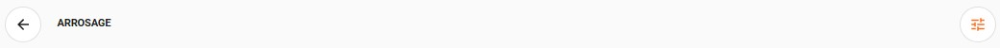
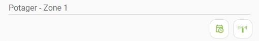
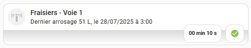
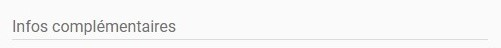
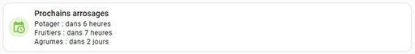
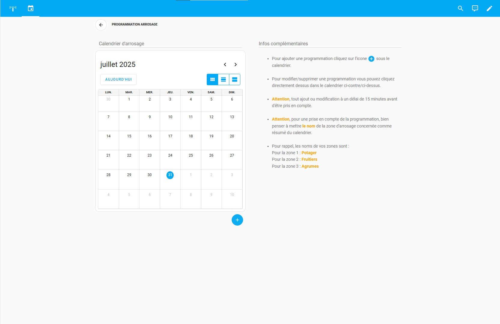
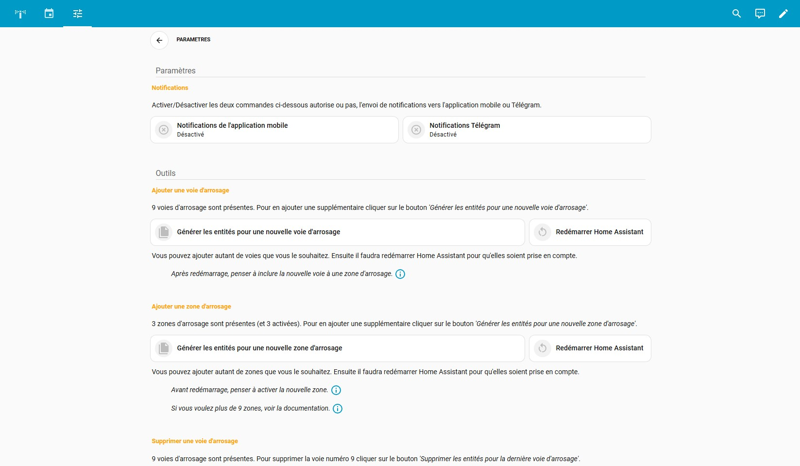
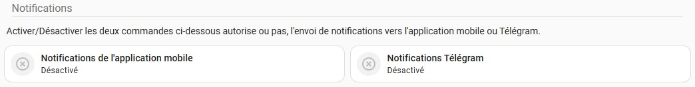

# Le dashboard arrosage

#### Integrations nécessaires à la mise en place du dashboard arrosage :

* Calendrier local disponible dans les intégrations de base de HA
* Les [mushrooms card](https://github.com/piitaya/lovelace-mushroom?tab=readme-ov-file#-mushroom) disponibles sur HACS
* [Card mod 3](https://github.com/thomasloven/lovelace-card-mod?tab=readme-ov-file#card-mod-3) disponible sur HACS
* [Vertical stack in card](https://github.com/ofekashery/vertical-stack-in-card?tab=readme-ov-file#vertical-stack-in-card) disponible sur HACS
* [Timer bar card](https://github.com/rianadon/timer-bar-card?tab=readme-ov-file#timer-bar-card) disponible sur HACS
* [Calendar merge](https://github.com/kgn3400/calendar_merge?tab=readme-ov-file#calendar-merge-helper) disponible sur HACS
* [Streamline card](https://github.com/brunosabot/streamline-card) disponible sur HACS

  
*Comment installer ce dashboard sur Home assistant : [Voir](https://github.com/tochy83/My-irrigation-system-for-HA/blob/main/Medias/Install/add_dashboard.gif)*
 
*Le code du dashboard complet : [Voir](https://github.com/tochy83/My-irrigation-system-for-HA/blob/main/Dashboard/dashboard.yaml)*
  

> Certains screenshots présents ci-dessous peuvent ne pas être à jour car j'ai ajouté de nouvelles fonctionnalités depuis que j'ai rédigé cette page.
 

### La page arrosage  

Une vue d'ensemble de la page arrosage.

 

Une vue d'ensemble de la page arrosage lorsqu'un arrosage de zone est en cours.

 

*Le code de la page : [Voir](https://github.com/tochy83/My-irrigation-system-for-HA/blob/main/Dashboard/arrosage_page.yaml)*
  

#### Les cartes qui la composent :

#### - ***La carte navigation*** :

Une carte qui affiche simplement le nom de la page en affichée et 2 boutons de navigation. 
 
 Permet de revenir à la page précedente.
 
 Permet d'accéder à la page Paramètres/Documentation de "l'intégration".
  

*Le code de la carte : [Voir](https://github.com/tochy83/My-irrigation-system-for-HA/blob/main/Dashboard/navigation_card.yaml)*
  

#### - ***La carte notification*** :

Cette carte affiche si un arrosage de zone est en cours. On retrouve l'heure de fin du cycle prévue ainsi qu'un bouton permettant d'arrêter l'arrosage de zone en cours.
  
L'ensemble des cartes notifications

Les boutons situés sur la droite des cartes permettent certaines actions :
  
 Permet de couper le cycle d'arrosage de la zone en cours.
 
 Renvoit sur la page calendrier de Home Asistant.
 
 Renvoit vers des pages de ce repository.
  

*Le code de la section notifications contenant toutes les cartes : [Voir](https://github.com/tochy83/My-irrigation-system-for-HA/blob/main/Dashboard/notifications_cards_section.yaml)*
  

#### - ***La carte zone*** :

Cette carte affiche le nom de la zone d'arrosage. Elle permet de choisir si la planification doit être activée pour cette zone d'arrosage également de déclencher un arrosage manuel de la zone.
  
 Permet de choisir si la planification doit être activée pour cette zone d'arrosage. Il est en vert lorsque la planification est active, en noir lorsqu'elle est inactive.
 
 En cliquant dessus on lance un cycle d'arrosage de la zone. Il passe alors en vert jusqu'a la fin du cycle pour indiquer qu'un cycle d'arrosage est en cours. Il ne permet pas d'arrêter le cycle d'arrosage en cours, pour cela il faut cliquer sur le bouton  dans la zone de notifications ou sur le bouton  de chaque carte électrovanne de la zone.
  

*Le code de la carte : [Voir](https://github.com/tochy83/My-irrigation-system-for-HA/blob/main/Dashboard/zone_card.yaml)*
  

#### - ***La carte électrovanne*** :

Cette carte permet de Déclencher/Arrêter une électrovanne manuellement. 
Elle permet aussi de régler la durée du cycle d'arrosage de cette électrovanne et d'inclure ou non cette électrovanne au cycle d'arrosage de la zone dans laquelle elle se trouve. 
Elle affiche également la date et l'heure du dernier cycle de fonctionnement l'électrovanne et volume d'arrosage du dernier cycle de fonctionnement si un dispositif de comptage d'eau est rattaché à "l'intégration".
  
 Permet de Déclencher/Arrêter l'arrosage de la voie.
 
 Permet de régler la durée de déclenchement de l'électrovanne.
 
 /  Permettent d'inclure ou d'exclure l'électrovanne au cycle d'arrosage de sa zone. Lorsque le bouton  est affiché en gris, l'électrovanne n'est pas incluse dans le cycle d'arrosage de sa zone. Quand le bouton  est affiché en vert, l'électrovanne est incluse dans le cycle d'arrosage de sa zone. Cliquer dessus bascule d'un état à l'autre.
  

*Le code de la carte : [Voir](https://github.com/tochy83/My-irrigation-system-for-HA/blob/main/Dashboard/electrovanne_card.yaml)*
  

#### - ***La carte électrovanne*** (Avec arrosage en cours) :

Quand une électrovanne est en fonctionnement l'affichage de la carte change pour afficher le temps restant.
   

#### - ***La carte électrovanne*** (Avec compteur d'eau) :

Si vouz avez un sensor qui comptabilise votre consommation d'eau, la consommation du dernier cycle de l'électrovanne peut être affiché.
   

#### - ***La carte titre*** :

Une carte qui affiche simplement un titre stylisé.
  

*Le code de la carte : [Voir](https://github.com/tochy83/My-irrigation-system-for-HA/blob/main/Dashboard/titre_card.yaml)*
  

#### - ***La carte prochains arrosages*** :

Cette carte récupère automatiquement les infos du calendrier d'arrosage pour les afficher. Par contre il est impératif pour qu'elle affiche quelque chose, d'avoir au préalable installer et configurer le helper [Calendar merge](https://github.com/kgn3400/calendar_merge) disponible sur HACS.
  
L'ensemble des cartes prochains arrosages

  

*Le code de la carte : [Voir](https://github.com/tochy83/My-irrigation-system-for-HA/blob/main/Dashboard/prochains_arrosages_card.yaml)*
  

#### - ***La carte programmation d'arrosage*** :

Carte qui permet d'afficher la page calendrier d'arrosage.
  

*Le code de la carte : [Voir](https://github.com/tochy83/My-irrigation-system-for-HA/blob/main/Dashboard/programmation_card.yaml)*
  

#### - ***La carte connectivité*** :

Si vous avez un sensor qui permet de savoir si vos électrovannes sont connectées à votre serveur Home Assistant, cette carte affiche l'état de la connectivité.
  

*Le code de la carte : [Voir](https://github.com/tochy83/My-irrigation-system-for-HA/blob/main/Dashboard/connectivity_card)*
  

#### - ***La carte compteur d'eau*** :

Si vous avez un sensor qui comptabilise votre consommation d'eau, cette carte affiche celle ci.
  

*Le code de la carte : [Voir](https://github.com/tochy83/My-irrigation-system-for-HA/blob/main/Dashboard/compteur_card.yaml)*
   

### La page calendrier d'arrosage  

Une vue d'ensemble de la page arrosage.

 

Le code de la page : [Voir](https://github.com/tochy83/My-irrigation-system-for-HA/blob/main/Dashboard/parameters_page.yaml)
  
Il n'y a pas grand chose à ajouter sur cette page, elle se contente d'afficher les infos du calendrier d'arrosage ainsi que comment ajouter une programmation de zone dans le calendrier.
   

### La page paramètres/documentation  

Une vue d'ensemble de la page arrosage.

 

Le code de la page : [Voir](https://github.com/tochy83/My-irrigation-system-for-HA/blob/main/Dashboard/parameters_page.yaml)
  
Une page en 2 parties. Une première partie avec des paramètres à ajuster pour "l'intégration" et une seconde avec une documentation simplifiée.

#### - ***Les cartes autorisation d'envoi de notifications*** :

Ces cartes ont pour but d'autoriser ou non l'envoie des notifications vers l'application mobile de Home Assistant ou vers Télégram. 
Avant d'autoriser l'envoi de notifications, assurez vous d'avoir l'application mobile d'installée et/ou l'intégration Télégram.
  
 /  Permettent d'autoriser ou non l'envoie des notifications vers l'application mobile de Home Assistant. Lorsque le bouton  est affiché en gris, les notifications ne seront pas envoyées vers l'application mobile/Télégram. Quand le bouton  est affiché en vert, les notifications seront envoyées vers l'application mobile/Télégram. Cliquer dessus bascule d'un état à l'autre.
  

*Le code de la section notifications : [Voir](https://github.com/tochy83/My-irrigation-system-for-HA/blob/main/Dashboard/enable_notifications_cards_section.yaml)*

  
