# Les pages et cartes du dashboard

Retrouvez sur cette page toutes les cartes du **Dashboard Arrosage**, ainsi que leurs fonctions et code.

> [!NOTE]
> Certains screenshots ou vidéos peuvent présenter de légères différences suite aux mises à jour de l'intégration. Dans ce cas une note est ajoutée à la partie concernée.

##


### La page principale

<p align="center"></p>

>📄 **Fichier :** [`Dashboard/arrosage_page.yaml`](Dashboard/arrosage_page.yaml)

<details>
  <summary><code> Voir le code de la page</code></summary>

<br>

📄 **Fichier :** [`Dashboard/arrosage_page.yaml`](Dashboard/arrosage_page.yaml)

```yml
type: sections
max_columns: 2
title: Arrosage
path: arrosage
icon: mdi:sprinkler-variant
cards: []
sections:
  - type: grid
    cards:
      - type: custom:mushroom-chips-card
        chips:
          - type: back
          - type: template
            content: ARROSAGE
            uix:
              style: |
                ha-card {
                  border: none;
                  background: none !important;
                }
          - type: spacer
          - type: template
            icon: mdi:calendar-clock
            icon_color: >-
              {{ 'deep-orange' if is_state('calendar.arrosage', 'unknown') else
              'light-green' }}
            tap_action:
              action: navigate
              navigation_path: planning-arrosage
          - type: template
            icon: mdi:tune
            icon_color: deep-orange
            tap_action:
              action: navigate
              navigation_path: parametres-dashboard-arrosage
        grid_options:
          columns: full
          rows: auto
    column_span: 2
  - type: grid
    cards:
      - type: vertical-stack
        cards:
          - type: custom:streamline-card
            template: misha_arrosage_notification_arrosage_en_cours
            variables:
              numero_de_la_zone: "1"
            grid_options:
              columns: full
          - type: custom:streamline-card
            template: misha_arrosage_notification_arrosage_en_cours
            variables:
              numero_de_la_zone: "2"
            grid_options:
              columns: full
          - type: custom:streamline-card
            template: misha_arrosage_notification_arrosage_en_cours
            variables:
              numero_de_la_zone: "3"
            grid_options:
              columns: full
        grid_options:
          columns: full
    column_span: 2
  - type: grid
    cards:
      - type: custom:streamline-card
        template: misha_arrosage_zone
        variables:
          numero_de_la_zone: "1"
      - type: custom:streamline-card
        template: misha_arrosage_voie
        variables:
          numero_de_la_voie: "1"
          nom_de_la_voie: Fraisiers
      - type: custom:streamline-card
        template: misha_arrosage_voie
        variables:
          numero_de_la_voie: "2"
          nom_de_la_voie: Tomates
      - type: custom:streamline-card
        template: misha_arrosage_voie
        variables:
          numero_de_la_voie: "3"
          nom_de_la_voie: Melons
      - type: custom:streamline-card
        template: misha_arrosage_voie
        variables:
          numero_de_la_voie: "4"
          nom_de_la_voie: Salades
      - type: custom:streamline-card
        template: misha_arrosage_voie
        variables:
          numero_de_la_voie: "8"
          nom_de_la_voie: Courgettes
      - type: custom:streamline-card
        template: misha_arrosage_zone
        variables:
          numero_de_la_zone: "2"
      - type: custom:streamline-card
        template: misha_arrosage_voie
        variables:
          numero_de_la_voie: "7"
          nom_de_la_voie: Abricotier/Poirier/Prunier
      - type: custom:streamline-card
        template: misha_arrosage_voie
        variables:
          numero_de_la_voie: "9"
          nom_de_la_voie: Pêcher/Figuier
  - type: grid
    cards:
      - type: custom:streamline-card
        template: misha_arrosage_zone
        variables:
          numero_de_la_zone: "3"
      - type: custom:streamline-card
        template: misha_arrosage_voie
        variables:
          numero_de_la_voie: "5"
          nom_de_la_voie: Oranger
      - type: custom:streamline-card
        template: misha_arrosage_voie
        variables:
          numero_de_la_voie: "6"
          nom_de_la_voie: Citronnier
      - type: custom:mushroom-title-card
        title: ""
        subtitle: Infos complémentaires
        uix:
          style: |
            .subtitle {
              border-bottom: 1px solid var(--ha-card-border-color,var(--divider-color,#e0e0e0));
              padding-bottom: 0px;
            }
            .header {
              margin-bottom: -7px;
            }
      - type: vertical-stack
        cards:
          - type: custom:mod-card
            uix:
              style: |
                ha-card {
                  background: #fff4e0;
                  --grid-card-gap: 0x;
                  border: 1px solid #dbdbdb;
                }
            card:
              type: grid
              square: false
              columns: 2
              cards:
                - type: custom:mushroom-template-card
                  multiline_secondary: true
                  primary: ""
                  secondary: >-
                    Vous n'avez pas encore installé l'intégration Calendrier
                    local.
                  icon: mdi:calendar-clock
                  tap_action:
                    action: none
                  color: deep-orange
                  features_position: bottom
                  uix:
                    style: |
                      ha-card {
                        border: none;
                        background: none;
                        margin-right: -100%;
                        padding-right: 100px;
                      }
                - type: custom:mushroom-chips-card
                  chips:
                    - type: template
                      icon: mdi:devices
                      tap_action:
                        action: navigate
                        navigation_path: /config/integrations/dashboard
                      uix:
                        style: |
                          ha-card {
                            border:none;
                            --chip-border-radius: 12px;
                            --chip-background: rgba(var(--rgb-primary-text-color), 0.1);
                          }
                    - type: template
                      tap_action:
                        action: url
                        url_path: >-
                          https://github.com/tochy83/My-irrigation-system-for-HA/blob/main/INSTALLATION.md#--etape-10-
                      icon: mdi:help-circle-outline
                      icon_color: light-blue
                      uix:
                        style: |
                          ha-card {
                            border:none;
                            --chip-border-radius: 12px;
                            --chip-background: rgba(var(--rgb-primary-text-color), 0.1);
                          }
                  alignment: end
                  uix:
                    style: |
                      ha-card {
                        background: none;
                        padding-right: 8px;
                        padding-top: 9px;
                      }
            grid_options:
              columns: full
            visibility:
              - condition: state
                entity: sensor.calendars
                state: "0"
          - type: custom:mod-card
            uix:
              style: |
                ha-card {
                  background: #fff4e0;
                  --grid-card-gap: 0x;
                  border: 1px solid #dbdbdb;
                }
            card:
              type: grid
              square: false
              columns: 2
              cards:
                - type: custom:mushroom-template-card
                  multiline_secondary: true
                  primary: ""
                  secondary: Vous n'avez pas encore créé de calendrier nommé Arrosage.
                  icon: mdi:calendar-clock
                  tap_action:
                    action: none
                  color: deep-orange
                  features_position: bottom
                  uix:
                    style: |
                      ha-card {
                        border: none;
                        background: none;
                        margin-right: -100%;
                        padding-right: 100px;
                      }
                - type: custom:mushroom-chips-card
                  chips:
                    - type: template
                      icon: mdi:calendar-edit-outline
                      tap_action:
                        action: navigate
                        navigation_path: /calendar
                      uix:
                        style: |
                          ha-card {
                            border:none; 
                            --chip-border-radius: 12px;
                            --chip-background: rgba(var(--rgb-primary-text-color), 0.1);
                          }
                    - type: template
                      tap_action:
                        action: url
                        url_path: >-
                          https://github.com/tochy83/My-irrigation-system-for-HA/blob/main/INSTALLATION.md#--etape-10-
                      icon: mdi:help-circle-outline
                      icon_color: light-blue
                      uix:
                        style: |
                          ha-card {
                            border:none; 
                            --chip-border-radius: 12px;
                            --chip-background: rgba(var(--rgb-primary-text-color), 0.1);
                          }
                  alignment: end
                  uix:
                    style: |
                      ha-card {
                        background: none;
                        padding-right: 8px;
                        padding-top: 9px;
                      }
            grid_options:
              columns: full
            visibility:
              - condition: state
                entity: calendar.arrosage
                state: unknown
              - condition: numeric_state
                entity: sensor.calendars
                above: 0
          - type: custom:mod-card
            uix:
              style: |
                ha-card {
                  background: #fff4e0;
                  --grid-card-gap: 0x;
                  border: 1px solid #dbdbdb;
                }
            card:
              type: grid
              square: false
              columns: 2
              cards:
                - type: custom:mushroom-template-card
                  multiline_secondary: true
                  primary: Prochains arrosages
                  secondary: Vous n'avez pas installé l'intégration Calendar Merge
                  icon: mdi:calendar-clock
                  tap_action:
                    action: navigate
                    navigation_path: /hacs
                  color: deep-orange
                  features_position: bottom
                  uix:
                    style: |
                      ha-card {
                        border: none;
                        background: none;
                        margin-right: -100%;
                        padding-right: 100px;
                      }
                - type: custom:mushroom-chips-card
                  chips:
                    - type: template
                      icon: mdi:store-plus-outline
                      tap_action:
                        action: navigate
                        navigation_path: /hacs
                      uix:
                        style: |
                          ha-card {
                            border:none; 
                            --chip-border-radius: 12px;
                            --chip-background: rgba(var(--rgb-primary-text-color), 0.1);
                          }
                  alignment: end
                  uix:
                    style: |
                      ha-card {
                        background: none;
                        padding-right: 8px;
                        padding-top: 9px;
                      }
            grid_options:
              columns: full
            visibility:
              - condition: state
                entity: update.calendar_merge_update
                state: unknown
              - condition: state
                entity: calendar.arrosage
                state_not: unknown
          - type: custom:mod-card
            uix:
              style: |
                ha-card {
                  background: #fff4e0;
                  --grid-card-gap: 0x;
                  border: 1px solid #dbdbdb;
                }
            card:
              type: grid
              square: false
              columns: 2
              cards:
                - type: custom:mushroom-template-card
                  multiline_secondary: true
                  primary: Prochains arrosages
                  secondary: Vous n'avez pas configuré l'entrée Calendar Merge
                  icon: mdi:calendar-clock
                  color: deep-orange
                  features_position: bottom
                  tap_action:
                    action: navigate
                    navigation_path: /config/helpers
                  uix:
                    style: |
                      ha-card {
                        border: none;
                        background: none;
                        margin-right: -100%;
                        padding-right: 100px;
                      }
                - type: custom:mushroom-chips-card
                  chips:
                    - type: template
                      icon: mdi:devices
                      tap_action:
                        action: navigate
                        navigation_path: /config/helpers
                      uix:
                        style: |
                          ha-card {
                            border:none; 
                            --chip-border-radius: 12px;
                            --chip-background: rgba(var(--rgb-primary-text-color), 0.1);
                          }
                    - type: template
                      tap_action:
                        action: url
                        url_path: >-
                          https://github.com/tochy83/My-irrigation-system-for-HA/blob/main/INSTALLATION.md#--etape-10-
                      icon: mdi:help-circle-outline
                      icon_color: light-blue
                      uix:
                        style: |
                          ha-card {
                            border:none; 
                            --chip-border-radius: 12px;
                            --chip-background: rgba(var(--rgb-primary-text-color), 0.1);
                          }
                  alignment: end
                  uix:
                    style: |
                      ha-card {
                        background: none;
                        padding-right: 8px;
                        padding-top: 9px;
                      }
            grid_options:
              columns: full
            visibility:
              - condition: state
                entity: calendar.misha_arrosage_a_venir
                state: unknown
              - condition: state
                entity: calendar.arrosage
                state_not: unknown
          - type: custom:mushroom-template-card
            multiline_secondary: true
            primary: Prochains arrosages
            secondary: >-
                


              

              {{states('sensor.misha_arrosage_a_venir_event_' ~ i)}}

              


              
                Aucune programmation d'arrosage prévue
              
            icon: mdi:calendar-clock
            color: light-green
            features_position: bottom
            tap_action:
              action: navigate
              navigation_path: planning-arrosage
            grid_options:
              columns: full
            visibility:
              - condition: state
                entity: calendar.misha_arrosage_a_venir
                state_not: unknown
              - condition: state
                entity: calendar.arrosage
                state_not: unknown
          - type: custom:mushroom-template-card
            primary: Programmation arrosage
            secondary: Voir/Modifier les horaires d'arrosage
            icon: mdi:calendar-clock
            color: light-green
            tap_action:
              action: navigate
              navigation_path: /dashboard-arrosage/planning-arrosage
            grid_options:
              columns: full
            visibility:
              - condition: state
                entity: calendar.arrosage
                state_not: unknown
            features_position: bottom
        grid_options:
          columns: full
      - type: custom:mushroom-chips-card
        chips:
          - type: spacer
        grid_options:
          columns: full
          rows: auto
        uix:
          style: |
            ha-card {
              padding-bottom: 10px;
            }
      - type: grid
        square: false
        columns: 2
        cards:
          - type: custom:streamline-card
            template: misha_arrosage_zone_conectivity
            variables:
              numero_de_la_zone: "1"
          - type: custom:streamline-card
            template: misha_arrosage_zone_conectivity
            variables:
              numero_de_la_zone: "2"
          - type: custom:streamline-card
            template: misha_arrosage_zone_conectivity
            variables:
              numero_de_la_zone: "3"
      - type: custom:mushroom-chips-card
        chips:
          - type: spacer
        grid_options:
          columns: full
          rows: auto
        uix:
          style: |
            ha-card {
              padding-bottom: 10px;
            }
      - type: custom:mushroom-template-card
        entity: sensor.misha_arrosage_compteur_eau
        primary: Compteur d'eau
        secondary: "{{ states(entity, with_unit=true) }}"
        multiline_secondary: true
        icon: mdi:water
        color: blue
        features_position: bottom
        grid_options:
          columns: full
```
</details>

<p align="center"></p>


#### **- La carte navigation**

<p align="center"></p>

Cette carte permet de naviguer entre les différentes pages du **dashboard**

 : Permet de revenir à la page précédemment affichée.

 : Permet de naviguer vers la page **Programmation d'arrosage**. Elle sera  si un calendrier nommé `Arrosage` existe sinon elle sera .

 : Permet de naviguer vers la page **Paramètres**.

<details>
  <summary><code> Voir le code de la carte</code></summary>

<br>

📄 **Fichier :** `Dashboard/navigation_card.yaml`

```yml
type: custom:mushroom-chips-card
chips:
  - type: back
  - type: template
    content: ARROSAGE
    uix:
      style: |
        ha-card {
          border: none;
          background: none !important;
        }
  - type: spacer
  - type: template
    icon: mdi:calendar-clock
    icon_color: >-
      {{ 'deep-orange' if is_state('calendar.arrosage', 'unknown') else
      'light-green' }}
    tap_action:
      action: navigate
      navigation_path: planning-arrosage
  - type: template
    icon: mdi:tune
    icon_color: deep-orange
    tap_action:
      action: navigate
      navigation_path: parametres-dashboard-arrosage
grid_options:
  columns: full
  rows: auto
```
</details>

<p align="center"></p>


#### **- La carte arrosage en cours**

<p align="center">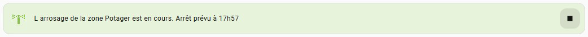</p>

Cette carte s'affichera quand un arrosage de zone est en cours.

 : Permet de couper l'arrosage de la zone avant son terme.

<details>
  <summary><code> Voir le code de la carte</code></summary>

<br>

📄 **Fichier :** `Dashboard/arrosage_en_cours_card.yaml`

```yml
type: conditional
conditions:
  - condition: state
    entity: input_boolean.misha_arrosage_cycle_zone_1
    state: "on"
card:
  type: custom:mod-card
  uix:
    style: |
      ha-card {
        background: #e8f3db;
        --grid-card-gap: 0x;
        border: 1px solid #dbdbdb;
      }
  card:
    type: grid
    square: false
    cards:
      - type: custom:mushroom-template-card
        multiline_secondary: true
        primary: ""
        secondary: >-
          L arrosage de la zone
          {{states('input_text.misha_arrosage_nom_de_zone_1')}} est en cours.
          Arrêt prévu à
          {{state_attr('input_datetime.misha_arrosage_duree_cycle_zone_1',
          'timestamp')| timestamp_custom("%Hh%M", true, now())}}
        icon: mdi:sprinkler-variant
        tap_action:
          action: none
        color: light-green
        features_position: bottom
        uix:
          style: |
            ha-card {
              border: none;
              background: none;
              margin-right: -100%;
              padding-right: 100px;
            }
      - type: custom:mushroom-chips-card
        chips:
          - type: template
            icon: mdi:stop
            tap_action:
              action: perform-action
              perform_action: script.misha_arrosage_arret
              data:
                zone_id: "1"
            uix:
              style: |
                ha-card {
                  border:none; 
                  --chip-border-radius: 12px;
                  --chip-background: rgba(var(--rgb-primary-text-color), 0.1);
                }
        alignment: end
        uix:
          style: |
            ha-card {
              background: none;
              padding-right: 8px;
              padding-top: 9px;
            }
    columns: 2
grid_options:
  columns: full
visibility:
  - condition: state
    entity: input_boolean.misha_arrosage_cycle_zone_1
    state: "on"
```
</details>

<p align="center"></p>


#### **- La carte zone**

<p align="center"></p>

Carte indiquant le nom de la zone ainsi que son id. Elle permet entre autre de déclencher un arrosage de zone manuellement.

 : Permet de modifier le nom de la zone.

: Indique le nombre de voies liées à la zone (ici 5). Elle seraquand tout est bien configuré,si aucune voie n'est liée à la zone etsi vous avez des voies réelles et virtuelles liées à la zone.

 : Indique si les voies de la zone sont connectées. Elle sera  en mode démo,  si toutes les voies de la zone sont connectées,  si des voies de la zone sont déconnectées et  si toutes les voies de la zone sont déconnectées. Elle permet du coup de savoir si on est en mode démo ou production (icone grise ou colorée).

 : Permet d'activer/désactiver la programmation. Elle passera  si la programmation est activée et  si la programmation est activée mais qu'aucun évènement n'est prévu dans le calendrier dans les 30 jours à venir.

 : Permet de déclencher un arrosage de zone. Elle passera en  quand une zone est en cours d'arrosage.
<br><br>

Cette carte dispose également de ces propres notifications.
<p align="center">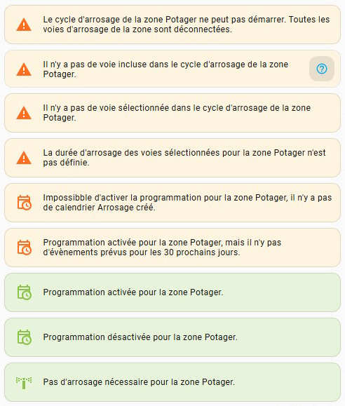</p>

<details>
  <summary><code> Voir le code de la carte</code></summary>

<br>

📄 **Fichier :** `Dashboard/zone_card.yaml`

```yml
type: vertical-stack
cards:
  - type: vertical-stack
    cards:
      - type: custom:mushroom-title-card
        subtitle: "{{ states('input_text.misha_arrosage_nom_de_zone_1') }}"
        uix:
          style: |
            .subtitle {
              border-bottom: 1px solid var(--ha-card-border-color,var(--divider-color,#e0e0e0));
            }
            .subtitle::after {
              content: "- Zone 1";
              font-size: var(--card-secondary-font-size);
            }
      - type: custom:mushroom-chips-card
        chips:
          - type: entity
            entity: input_text.misha_arrosage_nom_de_zone_1
            content_info: none
            icon_color: light-grey
            uix:
              style: |
                ha-card {
                  border: none; 
                  background: none !important;
                  --chip-icon-size: 12px;
                }
        alignment: end
        uix:
          style: |
            ha-card {
              margin-top: -36px;
              margin-left: 90%;
            }
    uix:
      style: |
        hui-card {
          border: none !important;
          background: none !important;
          margin-bottom: -8px;
        }   
  - type: conditional
    conditions:
      - condition: state
        entity: input_boolean.misha_arrosage_display_notifications
        state: "on"
      - condition: state
        entity: input_text.misha_arrosage_display_notifications_choix
        state: disconnected_zone_1
    card:
      type: custom:mushroom-template-card
      multiline_secondary: true
      primary: ""
      secondary: >-
        Le cycle d'arrosage de la zone {{
        states('input_text.misha_arrosage_nom_de_zone_1') }} ne peut pas
        démarrer. Toutes les voies d'arrosage de la zone sont déconnectées.
      icon: mdi:alert
      tap_action:
        action: none
      color: deep-orange
      features_position: bottom
      uix:
        style: |
          ha-card {
            background-color: #fff4e0;
          }
  - type: conditional
    conditions:
      - condition: state
        entity: input_boolean.misha_arrosage_display_notifications
        state: "on"
      - condition: state
        entity: input_text.misha_arrosage_display_notifications_choix
        state: voies_not_labeled_zone_1
    card:
      type: custom:vertical-stack-in-card
      cards:
        - type: custom:mushroom-template-card
          multiline_secondary: true
          primary: ""
          secondary: >-
            Il n'y a pas de voie incluse dans le cycle d'arrosage de la zone {{
            states('input_text.misha_arrosage_nom_de_zone_1') }}.
          icon: mdi:alert
          tap_action:
            action: none
          color: deep-orange
          features_position: bottom
          uix:
            style: |
              ha-card {
                background-color: #fff4e0;
                padding-right: 50px;
              }
        - type: custom:mushroom-chips-card
          chips:
            - type: template
              tap_action:
                action: url
                url_path: >-
                  https://github.com/tochy83/My-irrigation-system-for-HA/blob/main/DASHBOARD.md#--la-carte-%C3%A9lectrovanne-
              icon: mdi:help-circle-outline
              icon_color: light-blue
              uix:
                style: |
                  ha-card {
                    border:none; 
                    --chip-border-radius: 12px;
                    --chip-background: rgba(var(--rgb-primary-text-color), 0.1);
                  }
          alignment: end
          uix:
            style: |
              ha-card {
                margin-top: -46px;
                margin-left: 50%;
                padding-bottom: 8px;
                padding-left: 8px;
                padding-right: 8px;
              }
  - type: conditional
    conditions:
      - condition: state
        entity: input_boolean.misha_arrosage_display_notifications
        state: "on"
      - condition: state
        entity: input_text.misha_arrosage_display_notifications_choix
        state: voies_disabled_zone_1
    card:
      type: custom:mushroom-template-card
      multiline_secondary: true
      primary: ""
      secondary: >-
        Il n'y a pas de voie sélectionnée dans le cycle d'arrosage de la zone {{
        states('input_text.misha_arrosage_nom_de_zone_1') }}.
      icon: mdi:alert
      tap_action:
        action: none
      color: deep-orange
      features_position: bottom
      uix:
        style: |
          ha-card {
            background-color: #fff4e0;
          }
  - type: conditional
    conditions:
      - condition: state
        entity: input_boolean.misha_arrosage_display_notifications
        state: "on"
      - condition: state
        entity: input_text.misha_arrosage_display_notifications_choix
        state: voies_duree_zone_1
    card:
      type: custom:mushroom-template-card
      multiline_secondary: true
      primary: ""
      secondary: >-
        La durée d'arrosage des voies sélectionnées pour la zone {{
        states('input_text.misha_arrosage_nom_de_zone_1') }} n'est pas définie.
      icon: mdi:alert
      tap_action:
        action: none
      color: deep-orange
      features_position: bottom
      uix:
        style: |
          ha-card {
            background-color: #fff4e0;
          }
  - type: conditional
    conditions:
      - condition: state
        entity: input_boolean.misha_arrosage_display_notifications
        state: "on"
      - condition: state
        entity: input_text.misha_arrosage_display_notifications_choix
        state: no_calendar
    card:
      type: custom:mushroom-template-card
      multiline_secondary: true
      primary: ""
      secondary: >-
        Impossibble d'activer la programmation pour la zone {{
        states('input_text.misha_arrosage_nom_de_zone_1') }}, il n'y a pas de
        calendrier Arrosage créé.
      icon: mdi:calendar-clock-outline
      tap_action:
        action: none
      color: deep-orange
      features_position: bottom
      uix:
        style: |
          ha-card {
            background-color: #fff4e0;
          }
  - type: conditional
    conditions:
      - condition: state
        entity: input_boolean.misha_arrosage_display_notifications
        state: "on"
      - condition: state
        entity: input_text.misha_arrosage_display_notifications_choix
        state: programmation_no_evenements_zone_1
    card:
      type: custom:mushroom-template-card
      multiline_secondary: true
      primary: ""
      secondary: >-
        Programmation activée pour la zone {{
        states('input_text.misha_arrosage_nom_de_zone_1') }}, mais il n'y pas
        d'évènements prévus pour les 30 prochains jours.
      icon: mdi:calendar-clock-outline
      tap_action:
        action: none
      color: deep-orange
      features_position: bottom
      uix:
        style: |
          ha-card {
            background-color: #fff4e0;
          }                
  - type: conditional
    conditions:
      - condition: state
        entity: input_boolean.misha_arrosage_display_notifications
        state: "on"
      - condition: state
        entity: input_boolean.misha_arrosage_programmation_zone_1
        state: "on"
      - condition: state
        entity: input_text.misha_arrosage_display_notifications_choix
        state: programmation_on_zone_1
    card:
      type: custom:mushroom-template-card
      multiline_secondary: true
      primary: ""
      secondary: >-
        Programmation activée pour la zone {{
        states('input_text.misha_arrosage_nom_de_zone_1') }}.
      icon: mdi:calendar-clock-outline
      tap_action:
        action: none
      color: light-green
      features_position: bottom
      uix:
        style: |
          ha-card {
            background-color: #e8f3db;
          }
  - type: conditional
    conditions:
      - condition: state
        entity: input_boolean.misha_arrosage_display_notifications
        state: "on"
      - condition: state
        entity: input_boolean.misha_arrosage_programmation_zone_1
        state: "off"
      - condition: state
        entity: input_text.misha_arrosage_display_notifications_choix
        state: programmation_off_zone_1
    card:
      type: custom:mushroom-template-card
      multiline_secondary: true
      primary: ""
      secondary: >-
        Programmation désactivée pour la zone {{
        states('input_text.misha_arrosage_nom_de_zone_1') }}.
      icon: mdi:calendar-clock-outline
      tap_action:
        action: none
      color: light-green
      features_position: bottom
      uix:
        style: |
          ha-card {
            background-color: #e8f3db;
          }
  - type: conditional
    conditions:
      - condition: state
        entity: input_boolean.misha_arrosage_display_notifications
        state: "on"
      - condition: state
        entity: input_text.misha_arrosage_display_notifications_choix
        state: coef_meteo_zone_1
    card:
      type: custom:mushroom-template-card
      multiline_secondary: true
      primary: ""
      secondary: >-
        Pas d'arrosage nécessaire pour la zone {{
        states('input_text.misha_arrosage_nom_de_zone_1') }}.
      icon: mdi:sprinkler-variant
      tap_action:
        action: none
      color: light-green
      features_position: bottom
      uix:
        style: |
          ha-card {
            background-color: #e8f3db;
          }
  - type: custom:mushroom-chips-card
    chips:
      - type: template
        entity: sensor.misha_arrosage_data_zones
        content: >-
          {{states('input_number.misha_arrosage_electrovannes_incluses_zone_1')}}
        uix:
          style: |
            ha-card {
              border: none;
              --chip-background: none! important;
              padding-top: 14px;
              margin-bottom: -14px;
              margin-right: -10px;
              
              --text-color: {{ data_zones.color_text }};
            }
            ha-card ::slotted(span) {
              width: 18px;
              text-align: right;
            }
      - type: template
        entity: sensor.misha_arrosage_data_zones
        tap_action:
          action: none
        icon: mdi:check-network-outline
        icon_color: >
          

          {{ data_zones.color_network }}
        uix:
          style: |
            ha-card {
              border: none; 
              --chip-background: none! important;
              --chip-icon-size: 14px;
              margin-right: -16px;
              margin-left: -10px;
              padding-top: 11px;
              margin-bottom: -11px;
            }
      - type: template
        entity: input_boolean.misha_arrosage_programmation_zone_1
        tap_action:
          action: perform-action
          perform_action: script.misha_arrosage_programmation_zone_permuter_on_off
          data:
            zone_id: "1"
        content_info: none
        icon: mdi:calendar-clock-outline
        icon_color: >
          

          

          

          {{ color }}
        uix:
          style: |
            ha-card {
              --chip-border-radius: 12px;
            }
      - type: entity
        entity: input_boolean.misha_arrosage_cycle_zone_1
        tap_action:
          action: perform-action
          perform_action: input_boolean.turn_on
          target:
            entity_id: input_boolean.misha_arrosage_cycle_zone_1
        content_info: none
        icon_color: light-green
        uix:
          style: |
            ha-card {
              --chip-border-radius: 12px;
            }
    alignment: end
    uix:
      style: |
        ha-card {
          padding-right: 8px;
        }
```
</details>

<p align="center"></p>


#### **- La carte voie**

<p align="center">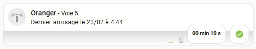</p>

*<p align="center">La carte sans arrosage en cours</p>*

<p align="center">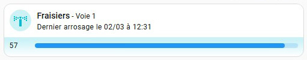</p>

*<p align="center">La carte avec arrosage en cours</p>*

Carte indiquant le nom de la voie et son id ainsi que la date et l'heure du dernier arrosage. Elle permet de déclencher la voie et également de la liée à une zone.

 : Permet de déclencher/arrêter la voie. Elle passe en  lorsque un arrosage est en cours.

 : Permet de lier la voie à une zone. Elle sera  si la voie est n'est pas liée à une zone, sinon elle sera .

> MAJ : Lorsque la voie est liée à une zone, un numéro indiquant la zone liée a été ajouté après l'icone 

 : Indique si la voie est connectée. Elle sera  en mode démo, sinon  si la voie est connectée, et  si la voie est déconnectée. Elle permet du coup de savoir si on est en mode démo ou production (icone grise ou colorée) toute comme la même icone sur la carte zone.

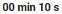 : Permet de régler la durée de déclenchement de la voie.

 : Permet de sélectionner/déselectionner la voie pour un cycle d'arrosage de zone. Elle passe en  lorsque la voie est sélectionnée ou  si cela n'est pas le cas.
<br><br>

Comme la carte zone, cette carte dispose de ces propres notifications.
<p align="center">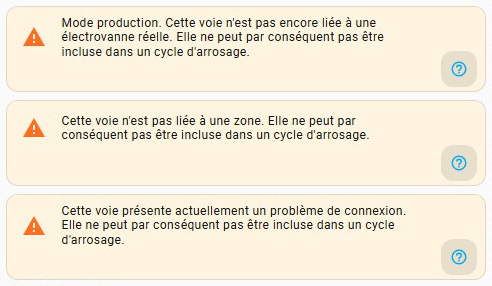</p>

<details>
  <summary><code> Voir le code de la carte</code></summary>

<br>

📄 **Fichier :** `Dashboard/voie_card.yaml`

```yml
type: vertical-stack
cards:
  - type: conditional
    conditions:
      - condition: state
        entity: input_text.misha_arrosage_display_notifications_choix
        state_not: mode_production_1
      - condition: state
        entity: input_text.misha_arrosage_display_notifications_choix
        state_not: voie_label_1
      - condition: state
        entity: input_text.misha_arrosage_display_notifications_choix
        state_not: voie_connect_1
    card:
      type: custom:vertical-stack-in-card
      cards:
        - type: custom:mushroom-template-card
          entity: switch.misha_arrosage_electrovanne_1
          multiline_secondary: true
          primary: Fraisiers
          secondary: >-
             
              
                
              
              Dernier arrosage {{ volume }}le {{ states('input_text.misha_arrosage_dernier_declenchement_voie_1') }}
              
          icon: mdi:sprinkler-variant
          tap_action:
            action: perform-action
            perform_action: script.misha_arrosage_nombre_electrovannes_par_zone
            data:
              voie: "1"
              update_label: "true"
          double_tap_action:
            action: more-info
          hold_action:
            action: more-info
          color: |-
            
              cyan
             
          features_position: bottom
          uix:
            style:
              ha-tile-info$: |
                .primary::slotted(span)::after {
                  content: " - Voie 1";
                  font-size: var(--tile-info-secondary-font-size);
                  font-weight: var(--tile-info-secondary-font-weight);
                }
        - type: conditional
          conditions:
            - condition: state
              entity: timer.misha_arrosage_voie_1
              state: idle
          card:
            type: custom:mushroom-chips-card
            chips:
              - type: template
                entity: switch.misha_arrosage_electrovanne_1
                tap_action:
                  action: more-info
                double_tap_action:
                  action: perform-action
                  perform_action: script.misha_arrosage_nombre_electrovannes_par_zone
                  data:
                    voie: "1"
                    update_label: "true"
                hold_action:
                  action: perform-action
                  perform_action: script.misha_arrosage_nombre_electrovannes_par_zone
                  data:
                    voie: "1"
                    update_label: "true"
                icon: mdi:dots-horizontal
                icon_color: >
                  

                  {{ data.color_link }}
                content: >
                  

                  {{ data.zone_id if data.zone_id !='none'}}
                uix:
                  style: |
                    ha-card {
                      border: none; 
                      background: none !important;
                      --chip-icon-size: 12px;
                      margin-right: -16px;
                      padding-top: 18px;
                      margin-bottom: -18px;
                      --text-color: #bdbdbd;
                      --chip-font-size: 10px;
                      --chip-font-weight: 400;
                    }
                    ha-card  ::slotted(span) {
                      --text-color: #bdbdbd;
                      --chip-font-size: 8px;
                      margin-left: -6px;
                      margin-top: -4px;
                    }
              - type: template
                tap_action:
                  action: none
                icon: mdi:check-network-outline
                icon_color: >
                  

                  {{ data.color_network }}
                uix:
                  style: |
                    ha-card {
                      border: none; 
                      background: none !important;
                      --chip-icon-size: 14px;
                      margin-right: -16px;
                      margin-left: -8px;
                      padding-top: 13px;
                      margin-bottom: -13px;
                    }
              - type: template
                entity: input_number.misha_arrosage_duree_voie_1
                content: "{{ states(entity) |int(0) | timestamp_custom('%M min %S s') }}"
                tap_action:
                  action: more-info
                uix:
                  style: |
                    ha-card {
                      --chip-border-radius: 12px;
                    }
              - type: template
                entity: input_boolean.misha_arrosage_enable_voie_1
                icon: >
                  {{ 'mdi:check-circle' if is_state(entity, 'on') else
                  'mdi:close-circle-outline' }}
                icon_color: >
                  

                  {{ data.color_enabled }}
                tap_action:
                  action: perform-action
                  perform_action: script.misha_arrosage_nombre_electrovannes_par_zone
                  data:
                    voie: "1"
                uix:
                  style: |
                    ha-card {
                      --chip-border-radius: 12px;
                    }
            alignment: end
            uix:
              style: |
                ha-card {
                  padding-top: 2px;
                  margin-top: -14px;
                  margin-left: 0px;
                  padding-bottom: 4px;
                  padding-left: 8px;
                  padding-right: 8px;
                }
        - type: conditional
          conditions:
            - condition: state
              entity: timer.misha_arrosage_voie_1
              state: active
          card:
            type: custom:timer-bar-card
            entity: timer.misha_arrosage_voie_1
            sync_issues: fix
            invert: true
            bar_direction: ltr
            bar_radius: 5px
            mushroom:
              primary_info: none
              icon_type: none
            uix:
              style: |
                ha-card {
                  transition: none !important;
                  padding: 0px !important;
                  --spacing: var(--mush-spacing, 10px) !important;
                  --icon-size: var(--mush-icon-size, 36px) !important;
                  background: none;
                  border: none;
                  margin-top: -4px;
                }
      uix:
        style: |
          ha-card {
            
              background: linear-gradient(180deg, rgba(204,242,247,1) 70%, rgba(255,255,255,1) 100%) !important;
              border-color: #DCDCDC;
            
              background: linear-gradient(180deg, rgba(171,171,171,1) 20%, rgba(255,255,255,1) 100%) !important;
              border-color: #DCDCDC;
            
          }
  - type: conditional
    conditions:
      - condition: state
        entity: input_boolean.misha_arrosage_display_notifications
        state: "on"
      - condition: state
        entity: input_text.misha_arrosage_display_notifications_choix
        state: mode_production_1
    card:
      type: custom:vertical-stack-in-card
      cards:
        - type: custom:mushroom-template-card
          multiline_secondary: true
          secondary: >-
            Mode production. Cette voie n'est pas encore liée à une électrovanne
            réelle. Elle ne peut par conséquent pas être incluse dans un cycle
            d'arrosage.
          tap_action:
            action: none
          features_position: bottom
          icon: mdi:alert
          color: deep-orange
          uix:
            style: |
              ha-card {
                background-color: #fff4e0;
                padding-right: 50px;
              }
        - type: custom:mushroom-chips-card
          chips:
            - type: template
              tap_action:
                action: url
                url_path: >-
                  https://github.com/tochy83/My-irrigation-system-for-HA/blob/main/DASHBOARD.md#--la-carte-%C3%A9lectrovanne-
              icon: mdi:help-circle-outline
              icon_color: light-blue
              uix:
                style: |
                  ha-card {
                    border:none; 
                    --chip-border-radius: 12px;
                    --chip-background: rgba(var(--rgb-primary-text-color), 0.1);
                  }
          alignment: end
          uix:
            style: |
              ha-card {
                margin-top: -17px;
                padding-bottom: 4px;
                padding-left: 8px;
                padding-right: 8px;
              }
      uix:
        style: |
          ha-card {
              background: #fff4e0;
          }
  - type: conditional
    conditions:
      - condition: state
        entity: input_boolean.misha_arrosage_display_notifications
        state: "on"
      - condition: state
        entity: input_text.misha_arrosage_display_notifications_choix
        state: voie_label_1
    card:
      type: custom:vertical-stack-in-card
      cards:
        - type: custom:mushroom-template-card
          multiline_secondary: true
          secondary: >-
            Cette voie n'est pas liée à une zone. Elle ne peut par conséquent
            pas être incluse dans un cycle d'arrosage.
          tap_action:
            action: none
          features_position: bottom
          icon: mdi:alert
          color: deep-orange
          uix:
            style: |
              ha-card {
                background-color: #fff4e0;
                padding-right: 50px;
              }
        - type: custom:mushroom-chips-card
          chips:
            - type: template
              tap_action:
                action: url
                url_path: >-
                  https://github.com/tochy83/My-irrigation-system-for-HA/blob/main/DASHBOARD.md#--la-carte-%C3%A9lectrovanne-
              icon: mdi:help-circle-outline
              icon_color: light-blue
              uix:
                style: |
                  ha-card {
                    border:none; 
                    --chip-border-radius: 12px;
                    --chip-background: rgba(var(--rgb-primary-text-color), 0.1);
                  }
          alignment: end
          uix:
            style: |
              ha-card {
                margin-top: -10px;
                padding-bottom: 4px;
                padding-left: 8px;
                padding-right: 8px;
              }
      uix:
        style: |
          ha-card {
              background: #fff4e0;
          }
  - type: conditional
    conditions:
      - condition: state
        entity: input_boolean.misha_arrosage_display_notifications
        state: "on"
      - condition: state
        entity: input_text.misha_arrosage_display_notifications_choix
        state: voie_connect_1
    card:
      type: custom:vertical-stack-in-card
      cards:
        - type: custom:mushroom-template-card
          multiline_secondary: true
          secondary: >-
            Cette voie présente actuellement un problème de connexion. Elle ne
            peut par conséquent pas être incluse dans un cycle d'arrosage.
          tap_action:
            action: none
          features_position: bottom
          icon: mdi:alert
          color: deep-orange
          uix:
            style: |
              ha-card {
                background-color: #fff4e0;
                padding-right: 50px;
              }
        - type: custom:mushroom-chips-card
          chips:
            - type: template
              tap_action:
                action: url
                url_path: >-
                  https://github.com/tochy83/My-irrigation-system-for-HA/blob/main/DASHBOARD.md#--la-carte-%C3%A9lectrovanne-
              icon: mdi:help-circle-outline
              icon_color: light-blue
              uix:
                style: |
                  ha-card {
                    border:none; 
                    --chip-border-radius: 12px;
                    --chip-background: rgba(var(--rgb-primary-text-color), 0.1);
                  }
          alignment: end
          uix:
            style: |
              ha-card {
                margin-top: -17px;
                padding-bottom: 4px;
                padding-left: 8px;
                padding-right: 8px;
              }
      uix:
        style: |
          ha-card {
              background: #fff4e0;
          }
```
</details>

<p align="center"></p>


#### **- La carte informations programmation**

<p align="center">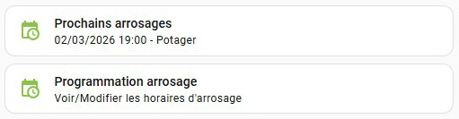</p>

La première carte indiquent les arrosages à venir par zone et la seconde renvoi la page de programmation d'arrosage.

Cette carte dispose aussi de ces propres notifications.
<p align="center">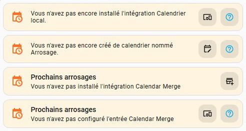</p>

 : Renvoi vers la page documentation du **dashboard arrosage**. Les autres icones renvoient vers les pages adéquates de **Home Assistant**.

<details>
  <summary><code> Voir le code de la carte</code></summary>

<br>

📄 **Fichier :** `Dashboard/informations_programmation_card.yaml`

```yml
type: vertical-stack
cards:
  - type: custom:mod-card
    uix:
      style: |
        ha-card {
          background: #fff4e0;
          --grid-card-gap: 0x;
          border: 1px solid #dbdbdb;
        }
    card:
      type: grid
      square: false
      columns: 2
      cards:
        - type: custom:mushroom-template-card
          multiline_secondary: true
          primary: ""
          secondary: Vous n'avez pas encore installé l'intégration Calendrier local.
          icon: mdi:calendar-clock
          tap_action:
            action: none
          color: deep-orange
          features_position: bottom
          uix:
            style: |
              ha-card {
                border: none;
                background: none;
                margin-right: -100%;
                padding-right: 100px;
              }
        - type: custom:mushroom-chips-card
          chips:
            - type: template
              icon: mdi:devices
              tap_action:
                action: navigate
                navigation_path: /config/integrations/dashboard
              uix:
                style: |
                  ha-card {
                    border:none;
                    --chip-border-radius: 12px;
                    --chip-background: rgba(var(--rgb-primary-text-color), 0.1);
                  }
            - type: template
              tap_action:
                action: url
                url_path: >-
                  https://github.com/tochy83/My-irrigation-system-for-HA/blob/main/INSTALLATION.md#--etape-10-
              icon: mdi:help-circle-outline
              icon_color: light-blue
              uix:
                style: |
                  ha-card {
                    border:none;
                    --chip-border-radius: 12px;
                    --chip-background: rgba(var(--rgb-primary-text-color), 0.1);
                  }
          alignment: end
          uix:
            style: |
              ha-card {
                background: none;
                padding-right: 8px;
                padding-top: 9px;
              }
    grid_options:
      columns: full
    visibility:
      - condition: state
        entity: sensor.calendars
        state: "0"
  - type: custom:mod-card
    uix:
      style: |
        ha-card {
          background: #fff4e0;
          --grid-card-gap: 0x;
          border: 1px solid #dbdbdb;
        }
    card:
      type: grid
      square: false
      columns: 2
      cards:
        - type: custom:mushroom-template-card
          multiline_secondary: true
          primary: ""
          secondary: Vous n'avez pas encore créé de calendrier nommé Arrosage.
          icon: mdi:calendar-clock
          tap_action:
            action: none
          color: deep-orange
          features_position: bottom
          uix:
            style: |
              ha-card {
                border: none;
                background: none;
                margin-right: -100%;
                padding-right: 100px;
              }
        - type: custom:mushroom-chips-card
          chips:
            - type: template
              icon: mdi:calendar-edit-outline
              tap_action:
                action: navigate
                navigation_path: /calendar
              uix:
                style: |
                  ha-card {
                    border:none; 
                    --chip-border-radius: 12px;
                    --chip-background: rgba(var(--rgb-primary-text-color), 0.1);
                  }
            - type: template
              tap_action:
                action: url
                url_path: >-
                  https://github.com/tochy83/My-irrigation-system-for-HA/blob/main/INSTALLATION.md#--etape-10-
              icon: mdi:help-circle-outline
              icon_color: light-blue
              uix:
                style: |
                  ha-card {
                    border:none; 
                    --chip-border-radius: 12px;
                    --chip-background: rgba(var(--rgb-primary-text-color), 0.1);
                  }
          alignment: end
          uix:
            style: |
              ha-card {
                background: none;
                padding-right: 8px;
                padding-top: 9px;
              }
    grid_options:
      columns: full
    visibility:
      - condition: state
        entity: calendar.arrosage
        state: unknown
      - condition: numeric_state
        entity: sensor.calendars
        above: 0
  - type: custom:mod-card
    uix:
      style: |
        ha-card {
          background: #fff4e0;
          --grid-card-gap: 0x;
          border: 1px solid #dbdbdb;
        }
    card:
      type: grid
      square: false
      columns: 2
      cards:
        - type: custom:mushroom-template-card
          multiline_secondary: true
          primary: Prochains arrosages
          secondary: Vous n'avez pas installé l'intégration Calendar Merge
          icon: mdi:calendar-clock
          tap_action:
            action: navigate
            navigation_path: /hacs
          color: deep-orange
          features_position: bottom
          uix:
            style: |
              ha-card {
                border: none;
                background: none;
                margin-right: -100%;
                padding-right: 100px;
              }
        - type: custom:mushroom-chips-card
          chips:
            - type: template
              icon: mdi:store-plus-outline
              tap_action:
                action: navigate
                navigation_path: /hacs
              uix:
                style: |
                  ha-card {
                    border:none; 
                    --chip-border-radius: 12px;
                    --chip-background: rgba(var(--rgb-primary-text-color), 0.1);
                  }
          alignment: end
          uix:
            style: |
              ha-card {
                background: none;
                padding-right: 8px;
                padding-top: 9px;
              }
    grid_options:
      columns: full
    visibility:
      - condition: state
        entity: update.calendar_merge_update
        state: unknown
      - condition: state
        entity: calendar.arrosage
        state_not: unknown
  - type: custom:mod-card
    uix:
      style: |
        ha-card {
          background: #fff4e0;
          --grid-card-gap: 0x;
          border: 1px solid #dbdbdb;
        }
    card:
      type: grid
      square: false
      columns: 2
      cards:
        - type: custom:mushroom-template-card
          multiline_secondary: true
          primary: Prochains arrosages
          secondary: Vous n'avez pas configuré l'entrée Calendar Merge
          icon: mdi:calendar-clock
          color: deep-orange
          features_position: bottom
          tap_action:
            action: navigate
            navigation_path: /config/helpers
          uix:
            style: |
              ha-card {
                border: none;
                background: none;
                margin-right: -100%;
                padding-right: 100px;
              }
        - type: custom:mushroom-chips-card
          chips:
            - type: template
              icon: mdi:devices
              tap_action:
                action: navigate
                navigation_path: /config/helpers
              uix:
                style: |
                  ha-card {
                    border:none; 
                    --chip-border-radius: 12px;
                    --chip-background: rgba(var(--rgb-primary-text-color), 0.1);
                  }
            - type: template
              tap_action:
                action: url
                url_path: >-
                  https://github.com/tochy83/My-irrigation-system-for-HA/blob/main/INSTALLATION.md#--etape-10-
              icon: mdi:help-circle-outline
              icon_color: light-blue
              uix:
                style: |
                  ha-card {
                    border:none; 
                    --chip-border-radius: 12px;
                    --chip-background: rgba(var(--rgb-primary-text-color), 0.1);
                  }
          alignment: end
          uix:
            style: |
              ha-card {
                background: none;
                padding-right: 8px;
                padding-top: 9px;
              }
    grid_options:
      columns: full
    visibility:
      - condition: state
        entity: calendar.misha_arrosage_a_venir
        state: unknown
      - condition: state
        entity: calendar.arrosage
        state_not: unknown
  - type: custom:mushroom-template-card
    multiline_secondary: true
    primary: Prochains arrosages
    secondary: |-
        

      
      {{states('sensor.misha_arrosage_a_venir_event_' ~ i)}}
      

      
        Aucune programmation d'arrosage prévue
      
    icon: mdi:calendar-clock
    color: light-green
    features_position: bottom
    tap_action:
      action: navigate
      navigation_path: planning-arrosage
    grid_options:
      columns: full
    visibility:
      - condition: state
        entity: calendar.misha_arrosage_a_venir
        state_not: unknown
      - condition: state
        entity: calendar.arrosage
        state_not: unknown
  - type: custom:mushroom-template-card
    primary: Programmation arrosage
    secondary: Voir/Modifier les horaires d'arrosage
    icon: mdi:calendar-clock
    color: light-green
    tap_action:
      action: navigate
      navigation_path: /dashboard-arrosage/planning-arrosage
    grid_options:
      columns: full
    visibility:
      - condition: state
        entity: calendar.arrosage
        state_not: unknown
    features_position: bottom
grid_options:
  columns: full
```
</details>

<p align="center"></p>


#### **- La carte connectivité**

<p align="center"></p>

Une carte grid, regroupant les cartes de connectivité de chaque zone.

 : Indique si les voies de la zone sont connectées. Elle sera  en mode démo,  si toutes les voies de la zone sont connectées,  si des voies de la zone sont déconnectées et  si toutes les voies de la zone sont déconnectées. Elle permet du coup de savoir si on est en mode démo ou production (icone grise ou colorée).

<details>
  <summary><code> Voir le code de la carte</code></summary>

<br>

📄 **Fichier :** `Dashboard/connectivity_card.yaml`

```yml
type: grid
square: false
columns: 2
cards:
  - type: custom:mushroom-template-card
    entity: sensor.misha_arrosage_data_zones
    primary: "{{ states('input_text.misha_arrosage_nom_de_zone_1') }}"
    secondary: >-
      

      

      

      {{ connectivity }}
    icon: >-
      

      {{ 'mdi:check-network-outline' if not data_zones.zone_disconnected else
      'mdi:network-off-outline' }}
    color: >-
      

      {{ data_zones.color_network }}
    features_position: bottom
```
</details>

##


### La page programmation arrosage

<p align="center">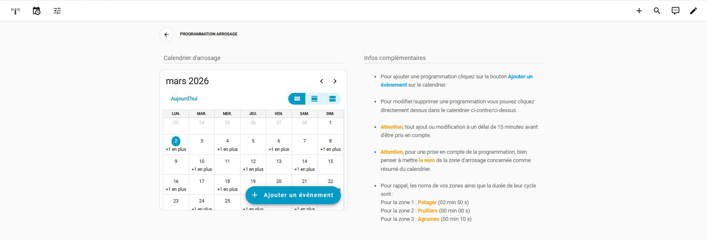</p>

Sur cette page vous pouvez définir la programmation de chaque zone en cliquant sur le bouton 

On retrouve en haut de la page une carte de navigation comme sur la page principale. Cette carte est utile si vous souhaitez faire de cette page une `sous-vue` sur votre dashboard.

La section `informations complémentaires` comprend des informations utiles pour l'ajout d'évènements au calendrier d'arrosage.

<details>
  <summary><code> Voir le code de la page</code></summary>

<br>

📄 **Fichier :** `Dashboard/calendar_page.yaml`

```yml
type: sections
max_columns: 2
title: Planning arrosage
path: planning-arrosage
icon: mdi:calendar-clock
cards: []
sections:
  - type: grid
    cards:
      - type: custom:mushroom-chips-card
        chips:
          - type: back
          - type: template
            content: PROGRAMMATION ARROSAGE
            tap_action:
              action: none
            uix:
              style: |
                ha-card {
                  border: none;
                  background: none !important;
                }
        grid_options:
          columns: full
          rows: auto
    column_span: 2
  - type: grid
    cards:
      - type: custom:mushroom-title-card
        title: ""
        subtitle: Calendrier d'arrosage
        uix:
          style: |
            .subtitle {
              border-bottom: 1px solid var(--ha-card-border-color,var(--divider-color,#e0e0e0));
              padding-bottom: 0px;
            }
            .header {
              margin-bottom: -7px;
            }
      - type: vertical-stack
        cards:
          - type: custom:mod-card
            uix:
              style: |
                ha-card {
                  background: #fff4e0;
                  --grid-card-gap: 0x;
                  border: 1px solid #dbdbdb;
                }
            card:
              type: grid
              square: false
              cards:
                - type: custom:mushroom-template-card
                  multiline_secondary: true
                  primary: ""
                  secondary: >-
                    Vous n'avez pas encore installé l'intégration Calendrier
                    local.
                  icon: mdi:calendar-clock
                  tap_action:
                    action: none
                  color: deep-orange
                  features_position: bottom
                  uix:
                    style: |
                      ha-card {
                        border: none;
                        background: none;
                        margin-right: -100%;
                        padding-right: 100px;
                      }
                - type: custom:mushroom-chips-card
                  chips:
                    - type: template
                      icon: mdi:devices
                      tap_action:
                        action: navigate
                        navigation_path: /config/integrations/dashboard
                      uix:
                        style: |
                          ha-card {
                            border:none;
                            --chip-border-radius: 12px;
                            --chip-background: rgba(var(--rgb-primary-text-color), 0.1);
                          }
                    - type: template
                      tap_action:
                        action: url
                        url_path: >-
                          https://github.com/tochy83/My-irrigation-system-for-HA/blob/main/INSTALLATION.md#--etape-10-
                      icon: mdi:help-circle-outline
                      icon_color: light-blue
                      uix:
                        style: |
                          ha-card {
                            border:none;
                            --chip-border-radius: 12px;
                            --chip-background: rgba(var(--rgb-primary-text-color), 0.1);
                          }
                  alignment: end
                  uix:
                    style: |
                      ha-card {
                        background: none;
                        padding-right: 8px;
                        padding-top: 9px;
                      }
              columns: 2
            grid_options:
              columns: full
            visibility:
              - condition: state
                entity: sensor.calendars
                state: "0"
          - type: custom:mod-card
            uix:
              style: |
                ha-card {
                  background: #fff4e0;
                  --grid-card-gap: 0x;
                  border: 1px solid #dbdbdb;
                }
            card:
              type: grid
              square: false
              cards:
                - type: custom:mushroom-template-card
                  multiline_secondary: true
                  primary: ""
                  secondary: Vous n'avez pas encore créé de calendrier nommé Arrosage.
                  icon: mdi:calendar-clock
                  tap_action:
                    action: none
                  color: deep-orange
                  features_position: bottom
                  uix:
                    style: |
                      ha-card {
                        border: none;
                        background: none;
                        margin-right: -100%;
                        padding-right: 100px;
                      }
                - type: custom:mushroom-chips-card
                  chips:
                    - type: template
                      icon: mdi:calendar-edit-outline
                      tap_action:
                        action: navigate
                        navigation_path: /calendar
                      uix:
                        style: |
                          ha-card {
                            border:none; 
                            --chip-border-radius: 12px;
                            --chip-background: rgba(var(--rgb-primary-text-color), 0.1);
                          }
                    - type: template
                      tap_action:
                        action: url
                        url_path: >-
                          https://github.com/tochy83/My-irrigation-system-for-HA/blob/main/INSTALLATION.md#--etape-10-
                      icon: mdi:help-circle-outline
                      icon_color: light-blue
                      uix:
                        style: |
                          ha-card {
                            border:none; 
                            --chip-border-radius: 12px;
                            --chip-background: rgba(var(--rgb-primary-text-color), 0.1);
                          }
                  alignment: end
                  uix:
                    style: |
                      ha-card {
                        background: none;
                        padding-right: 8px;
                        padding-top: 9px;
                      }
              columns: 2
            grid_options:
              columns: full
            visibility:
              - condition: state
                entity: calendar.arrosage
                state: unknown
              - condition: numeric_state
                entity: sensor.calendars
                above: 0
        grid_options:
          columns: full
      - type: calendar
        entities:
          - calendar.arrosage
  - type: grid
    cards:
      - type: custom:mushroom-title-card
        title: ""
        subtitle: Infos complémentaires
        uix:
          style: |
            .subtitle {
              border-bottom: 1px solid var(--ha-card-border-color,var(--divider-color,#e0e0e0));
              padding-bottom: 0px;
            }
            .header {
              margin-bottom: -7px;
            }
      - type: markdown
        content: >
          - Pour ajouter une programmation cliquez sur le bouton <font color
          ="#03a9f4">**Ajouter un évènement**</font> sur le calendrier.<br><br>

          - Pour modifier/supprimer une programmation vous pouvez cliquez
          directement dessus dans le calendrier ci-contre/ci-dessus.<br><br>

          - **<font color =orange>Attention</font>**, tout ajout ou modification
          à un délai de 15 minutes avant d'être pris en compte.<br><br>

          - **<font color =orange>Attention</font>**, pour une prise en compte
          de la programmation, bien penser à mettre **<font color =orange>le nom
          </font>** de la zone d'arrosage concernée comme résumé du
          calendrier.<br><br>

          - Pour rappel, les noms de vos zones ainsi que la durée de leur cycle
          sont :

          

          

          

          

          

          

          Pour la zone {{ zone_id }} : **<font color =orange>{{ states(item)
          }}</font>** ({{duree| timestamp_custom('%M min %S s')}})

          
        uix:
          style: |
            ha-card {
              color: var(--secondary-text-color);
              background: none;
              border: 0;
            }
              ha-markdown.no-header {
              padding-bottom: 0px !important;
            }
```
</details>

##


### La page paramètres

<p align="center">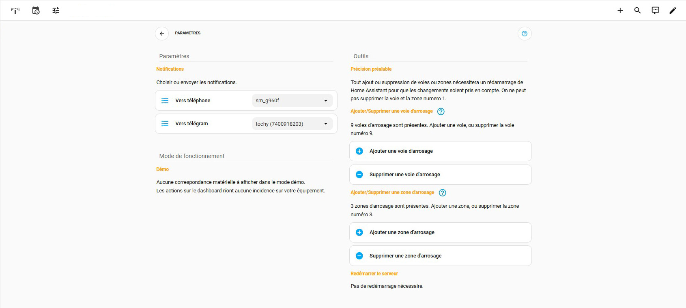</p>

On retrouve en haut de la page une carte de navigation comme sur la page principale. Cette carte est utile si vous souhaitez faire de cette page une `sous-vue` sur votre dashboard.

La section `Paramètres` permet de choisir où vous voulez envoyer les notifications.

La section `Mode de fonctionnement` indique si vous êtes en mode **démo** ou **production**. En mode production elle listera la correspondance entre les voies du dashboard et votre matériel.

La section `Mode de fonctionnement` Permet l'ajout ou la suppression de voies ou de zones en cliquant sur les boutons correspondants.

En cas d'ajout/suppression une carte apparaitra, indiquant qu'il est nécessaire de redémarrer le srveur pour prendre en compte les modifications.

<p align="center">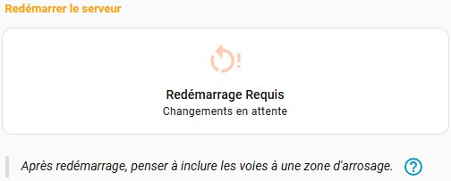</p>

En cas de suppression et après redémarrage du serveur, une carte listant les entités orphelines apparaitra, pour vous rappeler de les supprimer.

<p align="center">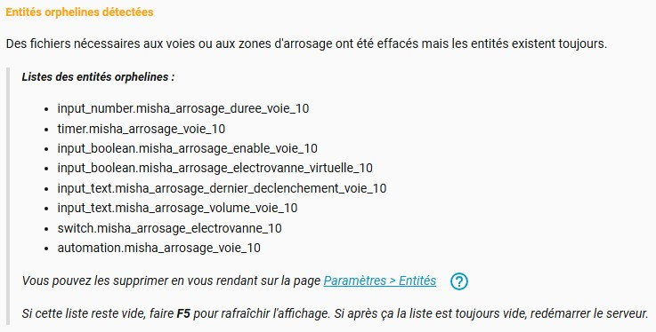</p>

Cette carte se masquera une fois les entités orphelines supprimées.

<details>
  <summary><code> Voir le code de la page</code></summary>

<br>

📄 **Fichier :** `ui-lovelace/cards/navigation_card.yaml`

```yml
type: sections
max_columns: 2
title: Paramètres Dashboard arrosage
path: parametres-dashboard-arrosage
icon: mdi:tune
cards: []
sections:
  - type: grid
    column_span: 2
    cards:
      - type: custom:mushroom-chips-card
        chips:
          - type: back
          - type: template
            content: PARAMETRES
            tap_action:
              action: none
            uix:
              style: |
                ha-card {
                  border: none;
                  background: none !important;
                }
          - type: spacer
          - type: template
            icon: mdi:help-circle-outline
            icon_color: light-blue
            tap_action:
              action: url
              url_path: >-
                https://github.com/tochy83/My-irrigation-system-for-HA/blob/main/DOCUMENTATION.md
        grid_options:
          columns: full
          rows: auto
  - type: grid
    column_span: 2
    cards:
      - type: custom:mushroom-title-card
        title: ""
        subtitle: Informations
        uix:
          style: |
            .subtitle {
              border-bottom: 1px solid var(--ha-card-border-color,var(--divider-color,#e0e0e0));
              padding-bottom: 0px;
            }
            .header {
              margin-bottom: -7px;
            }
        grid_options:
          columns: full
          rows: auto
      - type: markdown
        content: >-
          

          **<font color=orange size=2>Entités orphelines détectées</font>**


          Des fichiers nécessaires aux voies ou aux zones d'arrosage ont été
          effacés mais les entités existent toujours.


          > ***<font size=2>Listes des entités orphelines :***</font>

          > - {{ entites_orphelines | join('\n> - ') }}

          > 

          > *Vous pouvez les supprimer en vous rendant sur la page [Paramètres >
          Entités](/config/entities)* &nbsp;&nbsp;&nbsp;[<ha-icon
          icon="mdi:help-circle-outline"></ha-icon>](https://github.com/tochy83/My-irrigation-system-for-HA/blob/main/DOCUMENTATION.md#--les-entit%C3%A9s-orphelines)

          >

          > *Si cette liste reste vide, faire **F5** pour rafraîchir
          l'affichage. Si après ça la liste est toujours vide, redémarrer le
          serveur.*
        grid_options:
          columns: full
        text_only: true
    visibility:
      - condition: numeric_state
        entity: input_number.misha_arrosage_nb_entites_orphelines
        above: 0
  - type: grid
    column_span: 1
    cards:
      - type: custom:mushroom-title-card
        title: ""
        subtitle: Paramètres
        uix:
          style: |
            .subtitle {
              border-bottom: 1px solid var(--ha-card-border-color,var(--divider-color,#e0e0e0));
              padding-bottom: 0px;
            }
            .header {
              margin-bottom: -7px;
            }
        grid_options:
          columns: full
          rows: auto
      - type: markdown
        content: |-
          **<font color=orange size=2>Notifications</font>**

          Choisir ou envoyer les notifications.
        grid_options:
          columns: full
        text_only: true
      - type: tile
        entity: input_select.misha_arrosage_mobileapp_notifications
        name: Vers téléphone
        color: light-blue
        hide_state: true
        vertical: false
        features:
          - type: select-options
        features_position: inline
      - type: tile
        entity: input_select.misha_arrosage_telegram_notifications
        name: Vers télégram
        color: light-blue
        hide_state: true
        vertical: false
        features:
          - type: select-options
        features_position: inline
      - type: custom:mushroom-chips-card
        chips:
          - type: spacer
        grid_options:
          columns: full
          rows: auto
        uix:
          style: |
            ha-card {
              padding-bottom: 10px;
            }
      - type: custom:mushroom-title-card
        title: ""
        subtitle: Mode de fonctionnement
        uix:
          style: |
            .subtitle {
              border-bottom: 1px solid var(--ha-card-border-color,var(--divider-color,#e0e0e0));
              padding-bottom: 0px;
            }
            .header {
              margin-bottom: -7px;
            }
          columns: full
          rows: auto
      - type: markdown
        content: >-
          

          

          

          **<font color=orange size=2>Démo</font>**
              
          Aucune correspondance matérielle à afficher dans le mode démo. 

          Les actions sur le dashboard n'ont aucune incidence sur votre
          équipement.

          

          **<font color=orange size=2>Production</font>**


          Correspondance des voies avec votre matériel :

          

          - Voie {{ item.voie_id }} : {{ item.entite_reelle
          }}&nbsp;&nbsp;&nbsp;-->&nbsp;&nbsp;&nbsp;Zone {{ item.zone_id }}

          

          
        grid_options:
          columns: full
        text_only: true
      - type: custom:mushroom-chips-card
        chips:
          - type: spacer
        grid_options:
          columns: full
          rows: auto
        uix:
          style: |
            ha-card {
              padding-bottom: 10px;
            }
  - type: grid
    column_span: 1
    cards:
      - type: custom:mushroom-title-card
        title: ""
        subtitle: Outils
        uix:
          style: |
            .subtitle {
              border-bottom: 1px solid var(--ha-card-border-color,var(--divider-color,#e0e0e0));
              padding-bottom: 0px;
            }
            .header {
              margin-bottom: -7px;
            }
        grid_options:
          columns: full
          rows: auto
      - type: markdown
        content: >-
          **<font color=orange size=2>Précision préalable</font>**


          Tout ajout ou suppression de voies ou zones nécessitera un rédamarrage
          de Home Assistant pour que les changements soient pris en compte. On
          ne peut pas supprimer la voie et la zone numero 1. 
        text_only: true
      - type: markdown
        content: >-
          

          **<font color=orange size=2>Ajouter/Supprimer une voie
          d'arrosage</font>**&nbsp;&nbsp;&nbsp;[<ha-icon
          icon="mdi:help-circle-outline"></ha-icon>](https://github.com/tochy83/My-irrigation-system-for-HA/blob/main/DOCUMENTATION.md#--les-entit%C3%A9s-orphelines)


          

          {{ nb }} voies d'arrosage sont présentes. Ajouter une voie, ou
          supprimer la voie numéro {{ nb }}.

          

          Une seule voie d'arrosage est présente. Ajouter une voie.

          
        grid_options:
          columns: full
        text_only: true
      - type: custom:mushroom-template-card
        entity: script.misha_arrosage_generer_fichiers_voie
        primary: Ajouter une voie d'arrosage
        multiline_secondary: true
        icon: mdi:plus-circle
        color: "{{ 'light-green' if is_state(entity, 'on') else 'light-blue' }}"
        features_position: bottom
        tap_action:
          action: toggle
        grid_options:
          columns: full
      - type: custom:mushroom-template-card
        entity: script.misha_arrosage_supprimer_fichiers_voie
        primary: Supprimer une voie d'arrosage
        multiline_secondary: true
        icon: mdi:minus-circle
        color: "{{ 'light-green' if is_state(entity, 'on') else 'light-blue' }}"
        features_position: bottom
        tap_action:
          action: toggle
        visibility:
          - condition: numeric_state
            entity: input_number.misha_arrosage_nb_file_voies
            above: 1
        grid_options:
          columns: full
      - type: markdown
        content: >
          

          **<font color=orange size=2>Ajouter/Supprimer une zone
          d'arrosage</font>**&nbsp;&nbsp;&nbsp;[<ha-icon
          icon="mdi:help-circle-outline"></ha-icon>](https://github.com/tochy83/My-irrigation-system-for-HA/blob/main/DOCUMENTATION.md#--les-entit%C3%A9s-orphelines)


          

          {{ nb }} zones d'arrosage sont présentes. Ajouter une zone, ou
          supprimer la zone numéro {{ nb }}.

          

          Une seule zone d'arrosage est présente. Ajouter une zone.

          
        grid_options:
          columns: full
        text_only: true
      - type: custom:mushroom-template-card
        entity: script.misha_arrosage_generer_fichiers_zone
        primary: Ajouter une zone d'arrosage
        multiline_secondary: true
        icon: mdi:plus-circle
        color: "{{ 'light-green' if is_state(entity, 'on') else 'light-blue' }}"
        features_position: bottom
        tap_action:
          action: toggle
        grid_options:
          columns: full
      - type: custom:mushroom-template-card
        entity: script.misha_arrosage_supprimer_fichiers_zone
        primary: Supprimer une zone d'arrosage
        multiline_secondary: true
        icon: mdi:minus-circle
        color: "{{ 'light-green' if is_state(entity, 'on') else 'light-blue' }}"
        features_position: bottom
        tap_action:
          action: toggle
        visibility:
          - condition: numeric_state
            entity: input_number.misha_arrosage_nb_file_zones
            above: 1
        grid_options:
          columns: full
      - type: markdown
        content: "**<font color=orange size=2>Redémarrer le serveur</font>**"
        text_only: true
      - type: markdown
        content: Pas de redémarrage nécessaire.
        grid_options:
          columns: full
        text_only: true
        visibility:
          - condition: state
            entity: input_boolean.misha_arrosage_restart_needed
            state: "off"
      - type: custom:mushroom-template-card
        entity: script.misha_arrosage_redemarrer_ha
        primary: Redémarrage Requis
        secondary: Changements en attente
        tap_action:
          action: toggle
        icon: "{{'mdi:restart' if is_state(entity, 'on') else 'mdi:restart-alert'}}"
        color: "{{'light-green' if is_state(entity, 'on') else 'deep-orange'}}"
        features_position: bottom
        vertical: true
        grid_options:
          columns: full
        visibility:
          - condition: state
            entity: input_boolean.misha_arrosage_restart_needed
            state: "on"
        uix:
          style: |
            ha-state-icon {
              --mdc-icon-size: 40px;
                
                  animation: spin 1.5s linear infinite;
                
                  animation: pulse 2s linear infinite;
                
            }
            @keyframes pulse {
              50% { opacity: 0.2; }
            }
            @keyframes spin {
              from {transform: rotate(360deg);}
              to {transform: rotate(0deg);}
            }
      - type: markdown
        content: >
          >*Après redémarrage, penser à inclure les voies à une zone
          d'arrosage.*&nbsp;&nbsp;&nbsp;[<ha-icon
          icon="mdi:help-circle-outline"></ha-icon>](https://github.com/tochy83/My-irrigation-system-for-HA/blob/main/DOCUMENTATION.md#--inclure-une-voie-%C3%A0-une-zone-darrosage)
        grid_options:
          columns: full
        text_only: true
        visibility:
          - condition: state
            entity: input_boolean.misha_arrosage_restart_needed
            state: "on"
```
</details>

<br><br><br><br><br>
