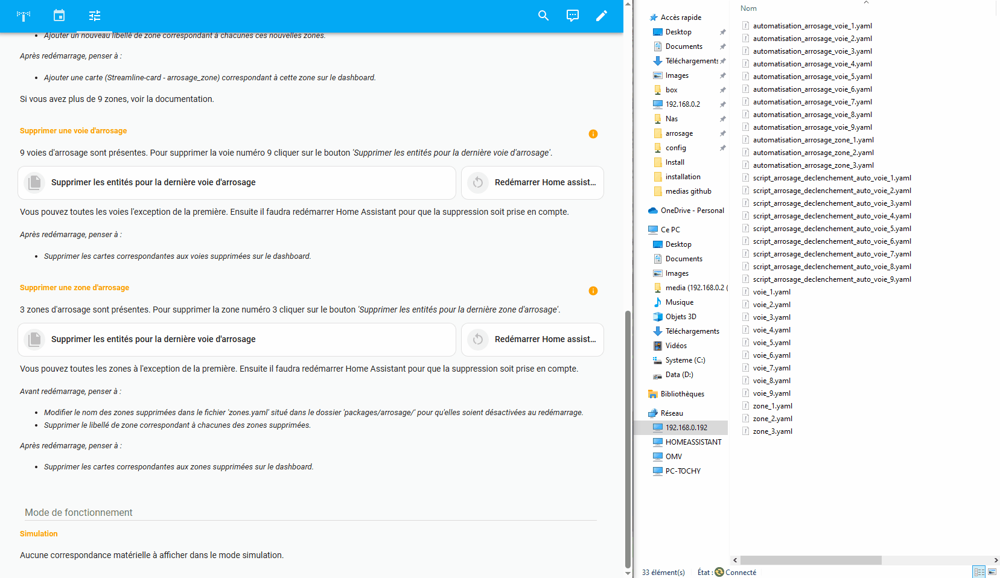
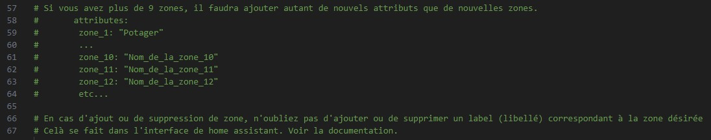
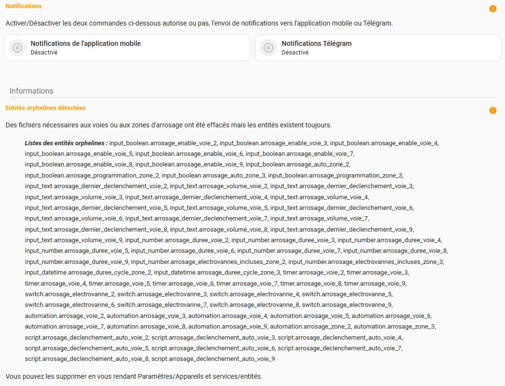
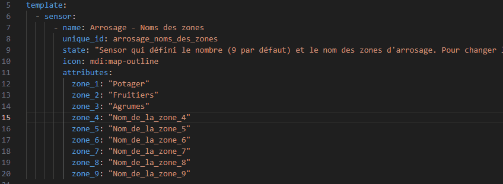
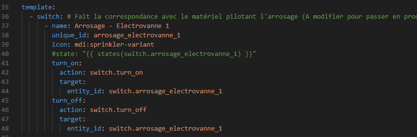
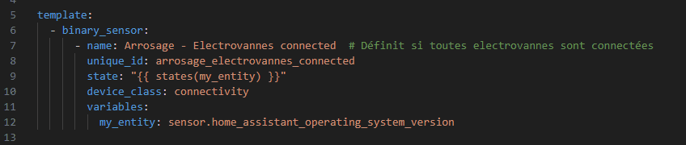

# Documentation


#### - Lexique

Parce que chaque culture/plantation a son propre besoin en eau, il faut bien comprendre le rôle du calendrier,  des voies d'arrosage, des zones d'arrosage et des cycles d'arrosage pour appéhender le fonctionnement de l'ensemble.
- Calendrier : Le calendrier contient les jours et heures de départ d'arrosage ainsi que le nom de la zone concernée (les événements). C'est lui qui définit **la fréquence d'arrosage** d'une zone.

- Voie d'arrosage : Une voie d'arrosage correspond à un ensemble électrovanne (ou autre système de commande) + tuyau + goutteurs (asperseurs, buses...) permettant l'arrosage d'une culture/plantation.
C'est sur la voie d'arrosage qu'on définit **la durée** d'ouverture de l'électrovanne et par conséquence **la quantité d'eau délivrée à chaque culture/plantation** présente sur cette voie.

- Zone d'arrosage : Une zone d'arrosage correspond à un groupe d'une ou plusieurs voies d'arrosage. Chaque voie d'arrosage incluse dans une même zone aura donc la même fréquence d'arrosage.

- Cycle d'arrosage de zone : Un cycle d'arrosage de zone pilote le déclenchement successif de chaque voie comprise dans la zone.

Pour résumé :
- On définit dans le calendrier les jours et heures de départ d'arrosage ainsi que le nom de la zone concernée (les événements).
- Lorsque la date présente correspond à un événement du calendrier, un ordre est envoyé pour declencher un arrosage de la zone renseignée dans l'événement du calendrier.
- Cet ordre déclenchera un cycle d'arrosage de la zone concernée.
- Le déclenchement du cycle ouvrira chaque éléctrovanne correspondante aux voies incluses dans la zone concernée, pour la durée définie pour chaque voie.
- L'ouverture de chaque éléctrovanne se fait en cascade, d'abord la première pour la durée que l'on aura choisi avant de passer à la seconde et ce jusqu'à la dernière incluse dans la zone.

On garde bien sûr la possibilité de déclencher un cycle ou une voie de façon manuelle.
<br><br>


#### - Les libellés de zone

C'est grâce au libellés (labels) que les cycles d'arrosage qu'ils soient programmés ou manuels fonctionnent. Pour cela il est important que chaque zone ait son libellé et que ce libellé soit supprimer si on supprime une zone.

Le nom des libellés a également son importance. Ils doivent être de la forme Zone 1, Zone 2 et ainsi de suite. 
<p align="center"></p>

Je n'ai malheureusement pas trouvé comment les créer ou les supprimer automatiquement. 
<br><br>


#### - Inclure une voie à une zone d'arrosage

Pour inclure une voie à une zone d'arrosage et ainsi permettre son déclenchement lors d'un cycle d'arrosage, automatique ou manuel, il faut :
- Ajouter un libellé de zone au script 'script.arrosage_declenchement_auto_voie_x' (x représentant le numéro de la voie à inclure dans la zone). Cette opération se fait par l'UI de Home Assistant ([Voir](DOCUMENTATION.md#--les-libell%C3%A9s-de-zone)).
<br><br>


#### - Ajouter une nouvelle voie d'arrosage

Un outil est présent dans la page paramètres de "l'intégration". Il permet de générer les fichiers d'entités, les automatisations et les scripts nécessaires au fonctionnement d'une voie d'arrosage.

<p align="center"></p>
<p align="center"><i>Les outils d'ajout et suppression de nouvelles voies et zones d'arrosage.</i></p>

Pour ajouter une voie d'arrosage il faut :
- Générer les fichiers.
- Redémarrer Home Assistant. Vous pouvez ajouter plusieurs voies avant le redémarrage de Home assistant.
- Ajouter une carte 'custom:streamline-card avec le template arrosage_voie' pour cette nouvelle voie sur le dashboard.

Nb: Si vous utilisez "l'intégration" en production avant de redémarrer Home Assistant, faites la correspondre avec votre matériel cela vous evitera un redémarrage supplémentaire ([Voir](DOCUMENTATION.md#--faire-correspondre-les-commandes-d%C3%A9lectrovannes-avec-son-mat%C3%A9riel)).
<br><br>


#### - Supprimer une voie d'arrosage

Un outil est présent dans la page paramètres de "l'intégration". Il permet de supprimer les fichiers d'entités, les automatisations et les scripts nécessaires au fonctionnement d'une voie d'arrosage.

Pour supprimer une voie d'arrosage il faut :
- Supprimer les fichiers.
- Redémarrer Home Assistant.
- Supprimer la carte de la voie sur le dashboard.
<br><br>


#### - Ajouter une zone d'arrosage

Par défaut l'intégration vient avec 3 zones actives et 6 autres zones qui n'attendent que leurs entités. Un outil est présent dans la page paramètres de "l'intégration". Il permet de générer les fichiers d'entités et les automatisations nécessaires au fonctionnement d'une zone d'arrosage.

Pour ajouter une zone il faut :
- Générer les fichiers.
- Activer la ou les nouvelles zones ([Voir](DOCUMENTATION.md#--activerd%C3%A9sactiver-une-zone)).
- Redémarrer Home Assistant pour leur prise en compte.
- Ajouter une carte 'custom:streamline-card avec le template arrosage_zone' pour cette nouvelle zone sur le dashboard.
<br><br>


#### - Si vous avez besoin de plus de 9 zones.

Il faudra en plus des étapes précédentes modifier certains sensors, scripts et automatisations pour en tenir compte.

Le sensor à modifier est :
- 'sensor.arrosage_noms_des_zones' situé dans le fichier 'zones.yaml' pour déclarer les zones supplémentaires.

Les modifications à effectuer sont indiquées dans les commentaires du fichier.

Le script à modifier est :
- 'script.arrosage_arret'.

Les automatisations à modifier sont :
- 'automation.arrosage_calendrier'.
- 'automation.arrosage_nombre_electrovannes_incluses_par_zone'.
- 'automation.arrosage_affichage_notifications_temporaires'.
- 'automation.arrosage_alerte'.

Les modifications à effectuer sont indiquées dans le descriptif du script et des automatisations.

Il faudra également ajouter au dashboard les cartes notifications correspondantes à ces nouvelles zones en dupliquant celles existantes et en modifiant le numéro de zone à l'intérieure de celles-ci.
<p align="center"></p>
<br>


#### - Pour supprimer une zone 

 Pour supprimer une zone les étapes sont les mêmes que pour supprimer une voie. Il faudra en plus désactiver cette zone ([Voir](DOCUMENTATION.md#--activerd%C3%A9sactiver-une-zone)).
 
 Vous pouvez également supprimer les cartes de notification pour la zone supprimée (mais ce n'est pas obligatoire).
<br><br>


#### - Note sur les outils de suppression de voie et de zone.

L'outil de suppression de voie ou de zone, permet de supprimer les fichiers d'entités, les automatisations et les scripts nécessaires au fonctionnement d'une voie ou d'une zone d'arrosage.

Il supprime les fichiers de la dernière voie ou zone existante. Par exemple si j'ai 9 voies d'arrosage il supprimera les fichiers de la voie 9.

L'outil de suppression ne sera en mesure d'effacer les automatisations et scripts, que si ceci n'ont pas été migrés dans l'UI de Home Assistant. Dans ce cas, il faudra les supprimer manuellement par l'interface utilisateur de Home Assistant.

Suite à la suppression des fichiers par l'outil, des entités orphelines peuvent apparaitre ([Voir](DOCUMENTATION.md#--les-entit%C3%A9s-orphelines)).
<br><br>


#### - Les entités orphelines.

Suite à la suppression des fichiers de définition d'une voie ou d'une zone, Home Assistant fera apparaitre des entités orphelines après redémarrage.

Une carte du dasboard, sur la page paramètres donne une liste de celles-ci. Cette carte n'est pas visible s'il n'y à pas d'entités orphelines liées à "l'intégration".

Pour les supprimer, il faut:
- Aller à Paramètres/Appareils et services/Entités, les rechercher et les supprimer.
- La suppression sera effective au prochain redémarrage de Home Assistant.
<p align="center"></p>
<p align="center"></p>
C'est là qu'il est pratique d'avoir défini un libellé ou une catégorie pour toutes les entités de l'intégration à l'installation de celle-ci, pour les retrouver plus rapidement.
<br><br>


#### - Activer/Désactiver une zone

Pour activer un zone d'arrosage, il faut :
- Modifier son nom, par le nom que vous voulez dans le fichier 'zones.yaml', présent dans le dossier 'packages/arrosage/'.
- Avoir ajouter un libellé pour cette zone ([Voir](DOCUMENTATION.md#--les-libell%C3%A9s-de-zone)).
- L'activation sera effective après redémarrage de Home Assistant.

Les zones inactives ont un nom de la forme 'Nom_de_la_zone_x' (x représentant le numéro de la zone).

Pour désactiver une zone, il faudra faire l'opération inverse à savoir :
- Remettre le nom par defaut pour la zone dans le fichier 'zones.yaml'.
- Supprimer son libellé.
- La désactivation sera effective après redémarrage de Home Assistant.

Les modifications à effectuer sont indiquées dans les commentaires du fichier.'zones.yaml'.
<p align="center"></p>
<br>


#### - Migrer les automatisions et les script

Vous pouvez migrer certaines automatisations dans Home Assistant afin de les modifier depuis l'UI. Pour cela il faut :
- Aller à Paramètres/Automatisations et scènes/Automatisation.
- Ouvrir l'automatisation que l'on souhaite migrer dans l'UI.
- Cliquer sur migrer et suivre les étapes.

Je ne conseille pas de migrer toute les automatisations, notamment celles dédiées aux voies et aux zones ou l'outil de suppression ne pourra plus les supprimer et vous devrez le faire à la main depuis l'UI.

La seule qui peut avoir un intêret de migrer est l'automatisation 'automation.arrosage_calendrier' sur laquelle on peut vouloir ajouter des conditions pour tenir compte de la météo ou de capteur de pluie, hygrométrie.

Sinon, si vous utiliser plus de 9 zones, vous pouvez également migrer le script 'script.arrosage_arret' et les automatisations 'automation.arrosage_nombre_electrovannes_incluses_par_zone', 'automation.arrosage_affichage_notifications_temporaires', 'automation.arrosage_alerte' qu'il faudra également modifiés et qu'il sera plus pratique à faire depuis l'UI.
<br><br>


#### - Faire correspondre les commandes d'électrovannes avec son matériel

Pour lier votre propre matériel commandant votre arrosage à l'intégration il faut :
- Modifier le template_switch 'switch.arrosage_electrovanne_x' (x représentant le numéro de l'éléctrovanne) dans les fichiers 'voie_x.yaml' situé dans le dossier 'packages/arrosage/' comme indiqué dans les commentaires de ces fichiers.
- Redémarrer Home Assistant pour la prise en compte des changements.

A partir de ce moment "l'intégration" ne sera plus en mode simulation mais pilotera vbraiment votre matériel.

Par exemple 'switch.d1mini_potager_arrosage_voie_1' correspondant à ma commande réelle :
<p align="center"></p>
<br>


#### - Ajouter son compteur d'eau

Pour prendre en compte son propre compteur d'eau il faut :
- Modifier le template sensor 'sensor.arrosage_compteur_eau' dans les fichiers 'config_autres_sensors.yaml' situé dans le dossier 'packages/arrosage/' comme indiqué dans les commentaires de ce fichier.
- Redémarrer Home Assistant pour la prise en compte des changements.

Si vous n'en avez pas vous pouvez laisser tel quel et simplement supprimer sa carte du dashboard. Ne supprimer pas le sensor, il est utilisé dans certaines carte du dashboard pour des calculs.

```yml
  - sensor:
      - name: Arrosage - Compteur eau
        unique_id: arrosage_compteur_eau
        state: "{{ states(my_entity) | int(0) }}"
        icon: mdi:water
        unit_of_measurement: L
        variables:
          my_entity: sensor.d1mini_verger_compteur_eau_jour

# Si vous n'avez pas de moyen de comptabliser votre consommation d'eau, laissez le sensor ci-dessus tel quel il affichera juste 0.
# Si vous en avez un, remplacer 'sensor.d1mini_verger_compteur_eau_jour' dans la ligne 'my_entity:'
# par votre entité qui comptabilise votre consommation d'eau.
```
<br><br>


#### - Modifier le binary_sensor de connectivité des electrovannes

Pour prendre en compte son propre sensor de connectivité des électrovannes il faut :
- Modifier le template_binary sensor 'binary_sensor.arrosage_electrovannes_connected' dans les fichiers 'config_autres_sensors.yaml' situé dans le dossier 'packages/arrosage/' comme indiqué dans les commentaires de ce fichier.
- Redémarrer Home Assistant pour la prise en compte des changements.

Si vous n'en avez pas vous pouvez laisser tel quel et simplement supprimer sa carte du dashboard. Ne supprimer pas le binary_sensor, il est utilisé dans certaines automatisations.

Par exemple mon sensor de connectivité est 'binary_sensor.arrosage_esp_status' qui est un group de binary :
<p align="center"></p>
<br>


#### - Stucture des fichiers de "l'intégration"

Voici comment sont structurés les fichiers de "l'intégration" une fois installée.

Le dossier racine 'arrosage' contient 4 fichiers et 2 dossiers :
- 'automatisation.yaml' regroupe les automatisations relatives aux notifications, calendrier et demise à jour de sensors.
- 'script.yaml' regroupe les scripts d'arrêt de cycle d'arrosage et d'envoi de notification vers l'application_mobile
- 'config_autres_sensors.yaml' regroupe les entités et commandes qui ne sont pas liés à une zone ou voie. 
- 'zones.yaml' regroupe les entités de configuration générale pour les zones.

Le sous-dossier 'voies_and_zones' contient les fichiers relatifs aux voies et aux zones. Il contient aussi bien des fichiers de déclaration d'entités que des automatisations ou scripts.
- 'voie_x.yaml' regroupe les entités pour une voie (comme d'habitude x représentant un numéro).
- 'zone_x.yaml'regroupe les entités pour une zone.
- 'automatisation_arrosage_voie_x.yaml' les automatisations qui gèrent le déclenchement manuel ou programmé d'une voie.
- 'automatisation_arrosage_zone_x.yaml' les automatisation qui gèrent le déclenchement d'un cycle d'arrosage de zone.
- 'script_arrosage_declenchement_auto_voie_x.yaml' les scripts permettant le declenchement en cascade des voies lors des cycles d'arrosage de zone.

Le sous-dossier 'generate_voies_and_zones' contient les fichiers les fichiers relatifs à la créations de nouvelles voies ou zones et un dossier.
- 'automatisation_init_at_start.yaml' permet de calculer et mettre à jour certaines entités pour les rendre disponible pour "l'intégration".
- 'scripts_arrosage_fichiers.yaml' regroupe les commandes permettant la création ou suppression des fichiers pour les voies et zones.
- 4 scripts python 'arrosage_generer_fichiers_voie.py', 'arrosage_generer_fichiers_zone.py', 'arrosage_supprimer_fichiers_voie.py' et 'arrosage_supprimer_fichiers_zone.py' qui générent les fichiers pour les voies et zones à partir d'un modéle.
- un script python 'arrosage_correspondance_materiel.py' qui stocke dans un fichier json la correspondance entre les voies "logicielles" de "l'intégration" et votre matériel déclenchant réellement votre arrosage (en mode production sinon il reste vide).
- 'arrosage_correspondance_materiel.json' le dit fichier json. En mode simulation il ne contient aucune données. Il se mettra à jour chaque fois que vous ferez correspondre une voie à votre propre matériel. (Voir)

Le sous-dossier 'modeles' contient les modèles de fichiers pour les outils de création/suppression de voies et zones.
- 'automatisation_arrosage_voie_x.txt'
- 'automatisation_arrosage_zone_x.txt'
- 'script_arrosage_declenchement_auto_voie_x.txt'
- 'voie_x.txt'
- 'zones.txt'

<div align="center">

<i>[Un visuel de la stucture complète](https://github.com/tochy83/My-irrigation-system-for-HA/blob/main/Medias/Install/structure_dossier_packages.jpg)</i>

</div>
<br>


#### - Supprimer l'intégration

Pour supprimer totalement "l'integration", il faut :
- Supprimer le dossier 'arrosage' situé dans les dossier 'packages/'.
- Redémarrer Home Assistant.
- Supprimer les libellés et eventuellemnt la catégorie si vous en aviez attribuée une.
- Supprimer toutes les entités orphelines liées à "l'intégration".
- Supprimer le dashboard.
- Redémarrer Home Assistant.

Nb: Si vous avez migré des automatisations ou script sous l'UI de Home Assistant il faudra alors les supprimer depuis celle-ci manuellement.
<br><br>


#### - Capteur de pluie ou d'humidité du sol

Je n'ai pas ajouté de prise en compte de ce type de capteurs dans "l'intégration" car je n'en dispose pas. Cependant si l'on souhaite en tenir compte il suffit simplement de les rajouter en conditions de l'automatisation 'automation.arrosage_calendrier'.

<br><br>


