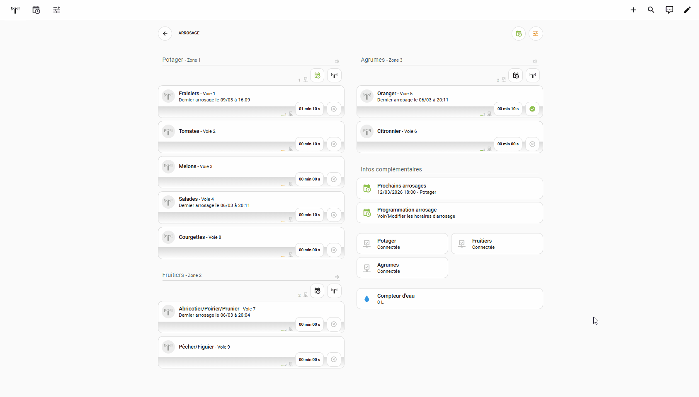

# Documentation

Retrouvez sur cette page toutes les cartes du **Dashboard Arrosage**, ainsi que leurs fonctions et code.

>[!NOTE]
> Certains screenshots ou vidéos peuvent présenter de légères différences suite aux mises à jour de l'intégration. Dans ce cas une note est ajoutée à la partie concernée.

<br>

##


### Préambule

Parce que chaque culture/plantation a son propre besoin en eau, il faut bien comprendre le rôle du calendrier,  des voies d'arrosage, des zones d'arrosage et des cycles d'arrosage pour appréhender le fonctionnement de l'ensemble.
- Calendrier : Le calendrier contient les jours et heures de départ d'arrosage ainsi que le nom de la zone concernée (les événements). C'est lui qui définit **`la fréquence d'arrosage`** d'une zone.

- Voie d'arrosage : Une voie d'arrosage correspond à un ensemble électrovanne (ou autre système de commande) + tuyau + goutteurs (asperseurs, buses...) permettant l'arrosage d'une culture/plantation.
C'est sur la voie d'arrosage qu'on définit **`la durée`** d'ouverture de l'électrovanne et par conséquence **`la quantité d'eau délivrée à chaque culture/plantation`** présente sur cette voie.

- Zone d'arrosage : Une zone d'arrosage correspond à un groupe d'une ou plusieurs voies d'arrosage. Chaque voie d'arrosage incluse dans une même zone aura donc la même fréquence d'arrosage.

- Cycle d'arrosage de zone : Un cycle d'arrosage de zone pilote le déclenchement successif de chaque voie comprise dans la zone.

Pour résumer :
- On définit dans le calendrier les jours et heures de départ d'arrosage ainsi que le nom de la zone concernée (les événements).
- Lorsque la date présente correspond à un événement du calendrier, un ordre est envoyé pour déclencher un arrosage de la zone renseignée dans l'événement du calendrier.
- Cet ordre déclenchera un cycle d'arrosage de la zone concernée.
- Le déclenchement du cycle ouvrira chaque électrovanne correspondante aux voies incluses dans la zone concernée, pour la durée définie pour chaque voie.
- L'ouverture de chaque électrovanne se fait en cascade, d'abord la première pour la durée que l'on aura choisi avant de passer à la seconde et ce jusqu'à la dernière incluse dans la zone.

On garde bien sûr la possibilité de déclencher un cycle ou une voie de façon manuelle.

<br>

##

### Documentation

<br>

#### - Ajouter/Supprimer une voie/zone

Pour ajouter/supprimer une voie/zone du **`Dashboard arrosage`**, cliquez sur les icones correspondantes dans la page **`Paramètres`**.

<p align="center"></p>

>[!IMPORTANT]
>Après ajout/suppression, il sera nécessaire de redémarrer le serveur pour prendre en compte les changements.&nbsp;&nbsp;&nbsp;[](#--red%C3%A9marrage-du-serveur)

>[!NOTE]
>Après ajout/suppression d'une voie, pensez à ajouter/supprimer une carte pour celle-ci.&nbsp;&nbsp;&nbsp;[](#--ajoutersupprimer-une-carte-voie)
>
>De même, après ajout/suppression d'une zone,  pensez à ajouter/supprimer une carte ainsi que les cartes liées, pour celle-ci.&nbsp;&nbsp;&nbsp;[](#--ajoutersupprimer-une-carte-zone)

<p align="center"></p>


#### - Redémarrage du serveur

Pour prendre en compte les changements lors de l'ajout/suppression de voies/zones, il est nécessaire de redémarrer le serveur. Cliquez simplement sur la carte prévue à cet effet qui apparaîtra automatiquement quand ce sera nécessaire.

<p align="center"></p>

<p align="center"></p>


#### - Ajouter/supprimer une carte zone et les cartes liées

La carte de zone ainsi que les cartes liées à une zone sont des cartes "streamlinées" **`misha_arrosage_zone`**, **`misha_arrosage_notification_arrosage_en_cours`** et **`misha_arrosage_zone_connectivity`**. Pour ces 3 cartes il faudra juste renseigner le numéro de la zone quand vous les ajoutez.

<p align="center"></p>

>[!NOTE]
>Il vous faudra également reconfigurer le helper **`Calendar Merge`** pour qu'il corresponde à votre nombre de zone.&nbsp;&nbsp;&nbsp;[](#--Configurer-Calendar-Merge)
>
>Pensez également à nommer vos zones.&nbsp;&nbsp;&nbsp;[](#--modifier-le-nom-dune-zone)

<p align="center"></p>


#### - Ajouter/supprimer une carte voie

La carte de voie est une carte "streamlinée" **`misha_arrosage_voie`**, il vous suffira d'ajouter la carte et de renseigner le numéro de la voie ainsi que son nom.

<p align="center"></p>

<p align="center"></p>


#### - Modifier le nom d'une zone

Pour modifier le nom d'une zone, cliquez sur  dans la carte zone.

<p align="center"></p>

<p align="center"></p>


#### - Modifier le nom d'une voie

La modification du nom d'une voie, se fait en éditant la carte de la voie.

<p align="center"></p>

<p align="center"></p>


#### - Les labels (étiquettes) de zone

C'est grâce au labels que les cycles d'arrosage  de zone, qu'ils soient programmés ou manuels fonctionnent. Pour cela, il faut lier chaque voie de la zone avec le label de celle-ci.

Les labels de zone sont créés/supprimés automatiquement à chaque ajout/suppression d'une zone et ils sont nommés **`Misha Zone x`**, x représentant le numéro de la zone.

<p align="center"></p>


#### - Les labels (étiquettes) de voie

C'est par les labels de voie que la liaison est faite entre voies virtuelles (mode démo) et un appareil pilotant votre arrosage.

Comme pour les labels de zone, ils sont créés/supprimés automatiquement à chaque ajout/suppression d'une voie et ils sont nommés **`Misha Voie x`**, x représentant le numéro de la voie.

<p align="center"></p>


#### - Lier/Enlever une voie à une zone

C'est par cette action que l'on renseigne les voies faisant partie d'une zone.

Un **`double-clic`** ou un **`appui long`** sur la partie blanche de la carte permet d'ajouter un **`label`**. Il faut ensuite effectuer un **`simple-clic`** pour mettre à jour les infos de la voie. Vous pouvez alternativement faire un **`simple-clic`** sur  pour ajouter le **`label`**.

Une fois liée à une zone, l’icône  deviendra  avec le numéro de la zone juste à coté. Le nombre de voie liées sur la carte zone sera également incrémenter/décrémenter.

<p align="center"></p>

<p align="center"></p>


#### - Lier/Enlever un appareil à une voie

C'est par cette action que l'on indique au **`Dashboard arrosage`** quels appareils il doit piloter.

Une fois un appareil lié à une voie, l’icône  deviendra ou  suivant la connectivité de l'appareil. Le changement de couleur  de l’icône permet de savoir si on est en mode démo ou production (icone grise ou colorée).

>[!IMPORTANT]
>Lier un appareil de votre configuration passera automatiquement le **`Dashboard arrosage`** en mode production.&nbsp;&nbsp;&nbsp;[](#--passer-en-mode-production)

<p align="center"></p>


#### - Modifier la durée d'une voie

Pour modifier la durée d'une voie, cliquez sur  et faites varier la durée à l'aide du curseur.

<p align="center"></p>

<p align="center"></p>


#### - Inclure/Exclure une voie d'un cycle d'arrosage

Pour inclure une voie à un cycle d'arrosage, cliquez sur / de la voie voulue.

<p align="center"></p>

<p align="center"></p>


#### - Ajouter un évènement au calendrier

Pour ajouter des évènements à la programmation, rendez vous sur la page **`Calendrier`** du serveur.

Vous pouvez simplement configurer la fréquence des évènements ainsi que définir une date de fin, après laquelle il n'y aura donc plus de programmation active.

<p align="center"></p>

Une fois les évènements ajoutés, il deviendront visible (après un certain délai) sur la carte **`Prochains arrosages`**.

<p align="center">

<p align="center"></p>


#### - Activer la programmation

Pour activer la programmation d'une zone, cliquez sur . Elle deviendra  si des évènements à venir sont présents dans le calendrier pour la zone concernée, sinon elle deviendra .

<p align="center"></p>

>[!NOTE]
>L'icône de programmation est mise à jour toutes les 12 heures ou au clic sur celle-ci. Ne vous inquiétez donc pas si elle reste orange même après que vous ayez ajouté des évènements au calendrier.

<p align="center"></p>


#### - Configurer Calendar Merge

Normalement vous avez déjà fait cette configuration lors de l'installation du **`Dashboard arrosage`**.&nbsp;&nbsp;&nbsp;[](INSTALLATION.md#8%EF%B8%8F%E2%83%A3-configuration-de-calendar-merge)

Toutefois si vous modifiez votre nombre de zone, il faudra reconfigurer le nombre d'évènements de cette intégration.

Pour accéder rapidement à la configuration de la carte, faites un **`double-clic`** sur celle-ci.

* **Nombre max d'événements :** Votre nombre de zone

<p align="center"></p>

>[!NOTE]
>Une fois mise à jour la carte affichera les évènéments à venir pour les x zones, il peut cependant y avoir un délai dans la mise à jour de celle-ci.

<p align="center"></p>


#### - Durée d'un cycle d'arrosage

La durée d'un cycle d'arrrosage de zone, est calculée en ajoutant la durée de chacune des voies liées à cette zone et à condition qu'elles soient également sélectionnées pour le cycle.

Cette somme est ensuite multipliée par le **`coefficient météo`**, pour donner la durée totale du cycle. C'est ce chiffre que vous verrez apparaître sur les notifications d'arrosage en cours.

>[!IMPORTANT]
>Le **`coefficient météo`** n'est pris en compte dans la durée du cycle, que pour les cycles lancés automatiquement par le **`calendrier d'arrosage`**. Tout lancement d'un cycle ou d'une voie de manière manuelle, ne tiendra pas compte de celui-ci.

<p align="center"></p>


#### - Le calcul du coefficient météo

Le calcul du **`coefficient météo`** est effectué dans le script **`script.misha_arrosage_calcul_coefficient_meteo`**.

Pour le modifier, il vous faudra éditer le fichier **`packages/misha_arrosage/settings/script_coeff_meteo.yaml`** et ajouter un template qui calculera celui-ci, àa la place de la valeur 1 sur la dernière ligne du fichier.

Le **`coefficient météo`** peut prendre une valeur entre 0 et 5 au pas de 0.1, la valeur 1 représentant 100%. Pour réduire la durée on mettra donc une valeur inférieure à 1 et pour l'augmenter une valeur supérieure.

Son calcul est lancé à chaque démarrage d'un cycle d'arrosage programmé. Il est remis à 100% tous les jours à minuit.

**📄 Fichier: `packages/misha_arrosage/settings/script_coeff_meteo.yaml`**
```yml
# Name : script_coeff_meteo.yaml
# Dans ce fichier, se trouve le script permettant le calcul du coefficient météo
# pour allonger ou réduire la durée des cycles d'arrosage.


script:

  misha_arrosage_calcul_coefficient_meteo:
    alias: Misha Arrosage - Calcul coefficient météo
    icon: mdi:stop-circle-outline
    description: >-
      Script permettant le calcul du coefficient météo. Il est appelé à chaque évènements déclenchés par le calendrier d'arrosage.
 
    sequence:
      - action: input_number.set_value
        target:
          entity_id: input_number.misha_arrosage_coefficient_meteo
        data:
          value: >
            1
```

**📄 `Un exemple de calcul donné par IA :`**
```yml
# Name : script_coeff_meteo.yaml
# Dans ce fichier, se trouve le script permettant le calcul du coefficient météo
# pour allonger ou réduire la durée des cycles d'arrosage.


script:

  misha_arrosage_calcul_coefficient_meteo:
    alias: Misha Arrosage - Calcul coefficient météo
    icon: mdi:sprinkler-variant
    description: >-
      Calcule le coefficient d'arrosage basé sur la pluie des dernières 24h 
      et la température maximale prévue.

    sequence:
      - action: input_number.set_value
        target:
          entity_id: input_number.misha_arrosage_coefficient_meteo
        data:
          value: >
            
            
            
            {# 1. Base du coefficient #}
            

            {# 2. Logique de Pluie : Si > 5mm, on n'arrose pas (coeff 0). Entre 1 et 5mm, on réduit de moitié #}
            
              
            
              
            

            {# 3. Logique de Température : Si > 30°C et qu'il n'a pas plu, on booste de 20% #}
            
              
            

            {{ coeff | round(2) }}
```

>[!NOTE]
>Comme toujours une modification dans un fichier **`.yaml`** nécessite un redémarrage du serveur ensuite pour être prise en compte.
>
>Je n'ai pas testé ce template, je l'ai juste mis à titre d'exemple.

<p align="center"></p>


#### - Les notifications

Les notifications liées au fonctionnement du **`Dashboard arrosage`** s'afficheront sur celui-ci. Il est possible de recevoir en plus des notifications sur **`l'application mobile`** ou/et **`télégram`** en fonction des choix que vous aurez effectuées sur la page **`Paramètres`**.

Les notifications ne concernent que les actions sur les cycles d'arrosage de zone et non les actions sur les voies.

<p align="center"></p>


#### - Choisir où recevoir les notifications

Tous les appareils mobiles et compte télégram liés à votre serveur **`Home Assistant`**, seront normalement reconnus automatiquement. Il faudra juste choisir dans la liste ou recevoir les notifications.

<p align="center"></p>

<p align="center"></p>


#### - Modifier les messages de notifications

Les messages de notifications sont définis dans le fichier **`packages/misha_arrosage/settings/arrosage_data_messages_notifications.json`**.

Vous pouvez les personnaliser dans une certaine mesure, en modifiant le contenu de **`titre`**, **`message`** et **`message_telegram`**.

Il y'a dans ces messages, des variables **`{zone_nom}`**, **`{heure}`**, **`{zone_id}`**, **`{message_erreur}`** ou commande Android **`clear_notification`** qu'il faudra respecter scrupuleusement si vous voulez qu'elles soient interprétées correctement.

Vous pouvez également jouez sur les paramètres **`color`**, **`icon`**, **`tag`** et **`persistent`** pour les ajuster à votre envie.

**📄 Fichier: `packages/misha_arrosage/settings/arrosage_data_messages_notifications.json`**
```json
{
    "cycle_started": {
        "titre": "{zone_nom}",
        "message": "Arrosage démarré {heure}.",
        "message_telegram": "Arrosage démarré {heure}.",
        "color": "cyan",
        "icon": "mdi:sprinkler-variant",
        "tag": "arrosage zone {zone_id}",
        "persistent": true
    },
    "cycle_ended": {
        "titre": "{zone_nom}",
        "message": "clear_notification",
        "message_telegram": "Arrosage terminé {heure}.",
        "color": "cyan",
        "icon": "mdi:sprinkler-variant",
        "tag": "arrosage zone {zone_id}",
        "persistent": false
    },
    "cycle_ended_error": {
      "titre": "{zone_nom}",
      "message": "Arrosage terminé {heure}.\n{message_erreur}",
      "message_telegram": "Arrosage terminé {heure}.\n{message_erreur}",
      "color": "cyan",
      "icon": "mdi:sprinkler-variant",
      "tag": "arrosage zone {zone_id}",
      "persistent": true
  },
    "cycle_stopped_manually": {
        "titre": "{zone_nom}",
        "message": "Arrêt manuel de l'arrosage {heure}.\n{message_erreur}",
        "message_telegram": "Arrêt manuel de l'arrosage {heure}.\n{message_erreur}",
        "color": "cyan",
        "icon": "mdi:sprinkler-variant",
        "tag": "arrosage zone {zone_id}",
        "persistent": true
    },
    "zone_disconnected": {
        "titre": "Arrosage - Problème",
        "message": "Le cycle d'arrosage de la zone {zone_nom} ne peut pas démarrer. Toutes les voies d'arrosage de la zone sont déconnectées.",
        "message_telegram": "Le cycle d'arrosage de la zone {zone_nom} ne peut pas démarrer. Toutes les voies d'arrosage de la zone sont déconnectées.",
        "color": "red",
        "icon": "mdi:sprinkler-variant",
        "tag": "arrosage",
        "persistent": true
      },
      "zone_no_time": {
        "titre": "Arrosage - Problème",
        "message": "Aucune durée d'arrosage n'est définie, pour les voies incluses à la zone {zone_nom}.",
        "message_telegram": "Aucune durée d'arrosage n'est définie, pour les voies incluses à la zone {zone_nom}.",
        "color": "red",
        "icon": "mdi:sprinkler-variant",
        "tag": "arrosage",
        "persistent": false
      },
      "coef_meteo": {
        "titre": "{zone_nom}",
        "message": "Pas d'arrosage nécessaire.",
        "message_telegram": "Pas d'arrosage nécessaire.",
        "color": "cyan",
        "icon": "mdi:sprinkler-variant",
        "tag": "arrosage zone {zone_id}",
        "persistent": false
      },
      "server_restarted": {
        "titre": "Arrosage interrompu",
        "message": "Le serveur a redémarré alors que {zones_count} {pluriel_zones} en cours d'arrosage. Les voies actives au moment du redémarrage termineront leur cycle, les suivantes ne seront déclenchées.",
        "message_telegram": "Le serveur a redémarré alors que {zones_count} {pluriel_zones} en cours d'arrosage. Les voies actives au moment du redémarrage termineront leur cycle, les suivantes ne seront déclenchées.",
        "color": "red",
        "icon": "mdi:sprinkler-variant",
        "tag": "arrosage",
        "persistent": true
      },
      "arrosage_alert": {
        "titre": "Arrosage - Attention",
        "message": "L'arrosage de la zone {zone_nom} semble être toujours en cours ! Un arrêt manuel de la zone a été declenché. Pensez à vérifier.",
        "message_telegram": "L'arrosage de la zone {zone_nom} semble être toujours en cours ! Un arrêt manuel de la zone a été declenché. Pensez à vérifier.",
        "color": "red",
        "icon": "mdi:sprinkler-variant",
        "tag": "arrosage",
        "persistent": true
      }
}
```

>[!NOTE]
>Comme toujours une modification dans un fichier, nécessite un redémarrage du serveur ensuite pour être prise ne compte.

<p align="center"></p>


#### - Ajouter son compteur d'eau

Si vous disposez d'un dispositif de comptage pour l'eau, vous pouvez l'ajouter au **`Dashboard arrosage`**.

Pour cela il vous faudra éditer le fichier **`packages/misha_arrosage/settings/sensor_compteur_eau.yaml`** et modifier la ligne **`my_entity: sensor.d1mini_verger_compteur_eau_jour`** pour mettre votre propre sensor à la place.

**📄 Fichier: `packages/misha_arrosage/settings/sensor_compteur_eau.yaml`**
```yml
# Name : sensor_compteur_eau.yaml


template:
  - sensor:
      - name: "Misha arrosage - Compteur eau" # Sensor faisant le lien vers un compteur d'eau
        unique_id: misha_arrosage_compteur_eau
        state: "{{ states(my_entity) | int(0) }}"
        icon: mdi:water
        unit_of_measurement: L
        variables:
          my_entity: sensor.d1mini_verger_compteur_eau_jour

        # Si vous n'avez pas de moyen de comptabliser votre consommation d'eau, laissez le sensor ci-dessus tel quel il affichera juste 0.
        # Si vous en avez un, remplacer 'sensor.d1mini_verger_compteur_eau_jour' dans la ligne 'my_entity:'
        # par votre entité qui comptabilise votre consommation d'eau.
```

>[!NOTE]
>Comme toujours une modification dans un fichier **`.yaml`** nécessite un redémarrage du serveur ensuite pour être prise ne compte.
>
>Si vous n'avez pas de dispositif de comptage, vous pouvez bien sur supprimer la carte **`Compteur d'eau`** du **`Dashboard arrosage`**.

<p align="center"></p>


#### - Passer en mode production

Pour basculer le **`Dashboard arrosage`** en mode production, il suffit de lier au minimum une voie à un appareil de votre configuration.&nbsp;&nbsp;&nbsp;[](#--lierenlever-un-appareil-%C3%A0-une-voie)

Lors de la bascule, toutes les voies virtuelles (mode démo) seront automatiquement désélectionnées des cycles de zone.

<p align="center"></p>


#### - Les entités orphelines

Après une suppression de voie/zone des entités orphelines se retrouveront présentes. Vous pouvez en voir la liste sur la page **`Paramètres`**.

<p align="center"></p>

Pour supprimer les entités orphelines, suivez le guide.

<p align="center"></p>

<p align="center"></p>


#### - La structure des dossiers/fichiers du package

```plaintext
📂 misha_arrosage/
├── 📂 automation_and_scripts/
│   ├── 📄 automatisation_alerte.yaml
│   ├── 📄 automatisation_calendrier.yaml
│   ├── 📄 automatisation_init_at_restart.yaml
│   ├── 📄 automatisation_reinitialise_coefficient_meteo.yaml
│   ├── 📄 automatisation_reset_nb_entites_orphelines.yaml
│   ├── 📄 automatisation_sauvegarde_choix_notifications.yaml
│   ├── 📄 script_arret.yaml
│   ├── 📄 script_declenchement_auto_voies.yaml
│   ├── 📄 script_envoi_notifications.yaml
│   ├── 📄 script_listes_appareils_pour_notifications.yaml
│   ├── 📄 script_maj_data_voies_and_zones.yaml
│   ├── 📄 script_notifications_temporaires.yaml
│   └── 📄 script_programmation_zone_permuter.yaml
├── 📂 core/
│   ├── 📂 data/
│   │   └── 📄 arrosage_data_preferences_notifications.json
│   ├── 📂 modeles/
│   │   ├── 📄 automatisation_voie_x.yaml
│   │   ├── 📄 automatisation_zone_x.yaml
│   │   ├── 📄 voie_x.yaml
│   │   └── 📄 zone_x.yaml
│   └── 📂 python/
│       ├── 📄 arrosage_data_preferences_notifications.py
│       ├── 📄 arrosage_generer_fichiers_voie.py
│       ├── 📄 arrosage_generer_fichiers_zone.py
│       ├── 📄 arrosage_supprimer_fichiers_voie.py
│       └── 📄 arrosage_supprimer_fichiers_zone.py
├── 📂 dashboard/
│   └── 📄 dashboard_arrosage.txt
├── 📂 settings/
│   ├── 📄 arrosage_data_messages_notifications.json
│   ├── 📄 script_coeff_meteo.yaml
│   └── 📄 sensor_compteur_eau.yaml
├── 📂 voies_and_zones/
│   ├── 📄 automatisation_voie_1.yaml
│   ├── 📄 automatisation_zone_1.yaml
│   ├── 📄 voie_1.yaml
│   └── 📄 zone_1.yaml
├── 📄 generic_sensors.yaml
├── 📄 sensor_data_voies.yaml
└── 📄 sensor_data_zones.yaml
```

Le 📂 voies_and_zones contient les fichiers qui sont générés automatiquement par les scripts python lors de l'ajout de voies ou de zones.

Le 📂 core contient tous les fichiers nécessaires à la génération de ceux-ci.

Le 📂 dashboard comme son nom l'indique contient le code des pages et cartes du dashboard.

Le 📂 settings contient les fichiers que vous pouvez modifier.


<p align="center"></p>


<br><br><br><br><br>

