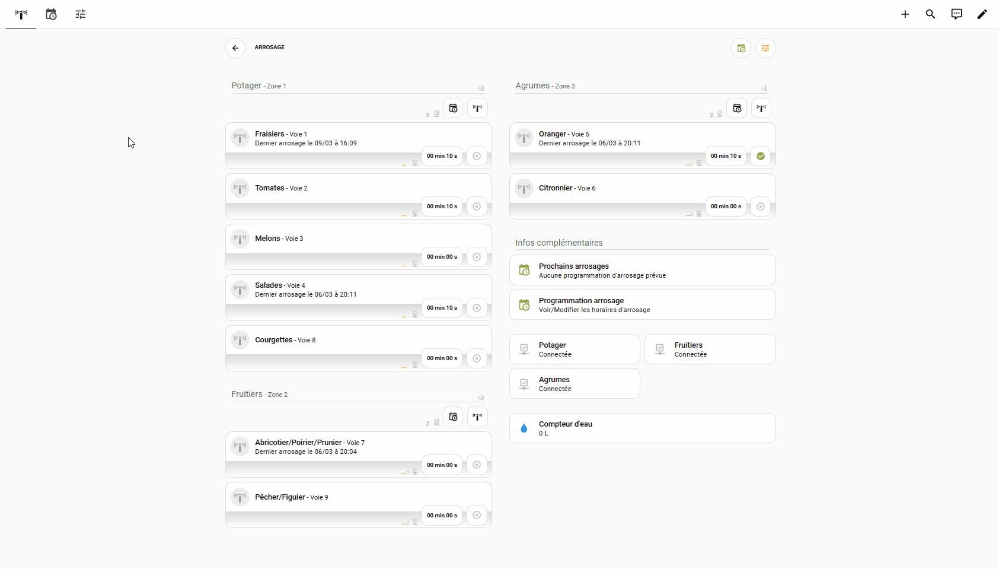
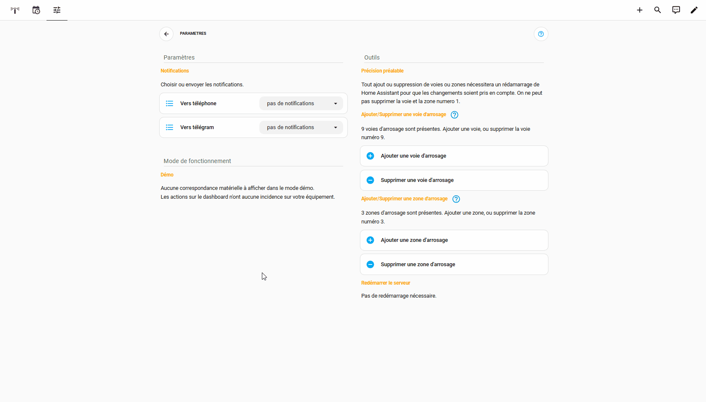
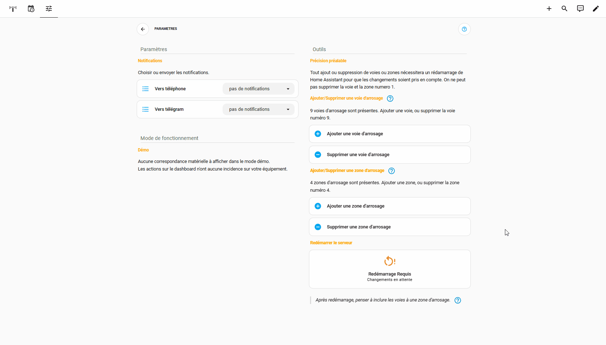
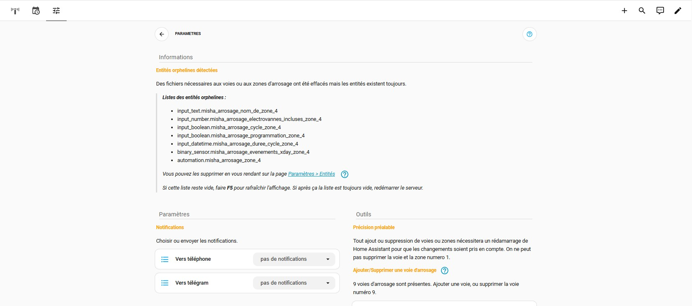
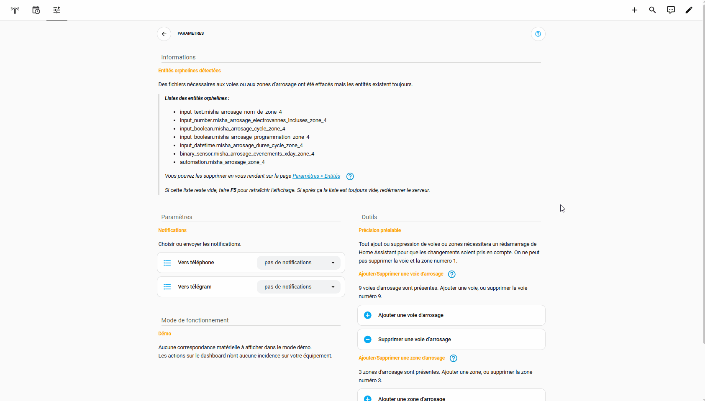
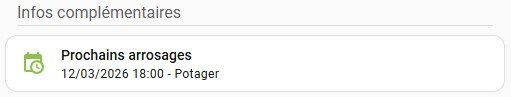
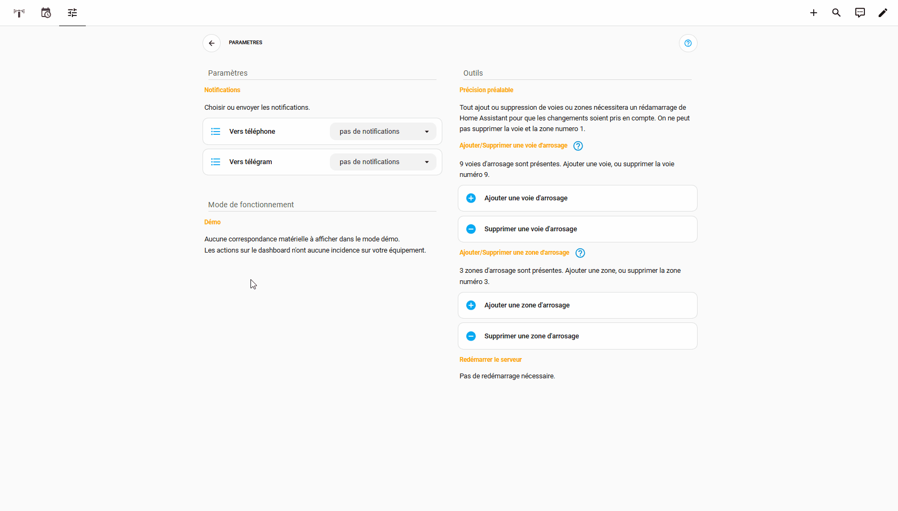

# Documentation

Retrouvez sur cette page toutes les cartes du **Dashboard Arrosage**, ainsi que leurs fonctions et code.

> [!NOTE]
> Certains screenshots ou vidéos peuvent présenter de légères différences suite aux mises à jour de l'intégration. Dans ce cas une note est ajoutée à la partie concernée.

 

##

#### Lexique

Parce que chaque culture/plantation a son propre besoin en eau, il faut bien comprendre le rôle du calendrier,  des voies d'arrosage, des zones d'arrosage et des cycles d'arrosage pour appréhender le fonctionnement de l'ensemble.
- Calendrier : Le calendrier contient les jours et heures de départ d'arrosage ainsi que le nom de la zone concernée (les événements). C'est lui qui définit **`la fréquence d'arrosage`** d'une zone.

- Voie d'arrosage : Une voie d'arrosage correspond à un ensemble électrovanne (ou autre système de commande) + tuyau + goutteurs (asperseurs, buses...) permettant l'arrosage d'une culture/plantation.
C'est sur la voie d'arrosage qu'on définit **`la durée`** d'ouverture de l'électrovanne et par conséquence **`la quantité d'eau délivrée à chaque culture/plantation`** présente sur cette voie.

- Zone d'arrosage : Une zone d'arrosage correspond à un groupe d'une ou plusieurs voies d'arrosage. Chaque voie d'arrosage incluse dans une même zone aura donc la même fréquence d'arrosage.

- Cycle d'arrosage de zone : Un cycle d'arrosage de zone pilote le déclenchement successif de chaque voie comprise dans la zone.

Pour résumé :
- On définit dans le calendrier les jours et heures de départ d'arrosage ainsi que le nom de la zone concernée (les événements).
- Lorsque la date présente correspond à un événement du calendrier, un ordre est envoyé pour déclencher un arrosage de la zone renseignée dans l'événement du calendrier.
- Cet ordre déclenchera un cycle d'arrosage de la zone concernée.
- Le déclenchement du cycle ouvrira chaque électrovanne correspondante aux voies incluses dans la zone concernée, pour la durée définie pour chaque voie.
- L'ouverture de chaque électrovanne se fait en cascade, d'abord la première pour la durée que l'on aura choisi avant de passer à la seconde et ce jusqu'à la dernière incluse dans la zone.

On garde bien sûr la possibilité de déclencher un cycle ou une voie de façon manuelle.

 

##

#### - Les labels (étiquettes) de zone

C'est grâce au labels que les cycles d'arrosage  de zone, qu'ils soient programmés ou manuels fonctionnent. Pour cela, il faut lier chaque voie de la zone avec le label de celle-ci.

Les labels de zone sont créés/supprimés automatiquement à chaque ajout/suppression d'une zone et ils sont nommés **`Misha Zone x`**, x représentant le numéro de la zone.

#### - Les labels (étiquettes) de voie

C'est par les labels de voie que la liaison est faite entre voies virtuelles (mode démo) et un appareil pilotant votre arrosage.

Comme pour les labels de zone, ils sont créés/supprimés automatiquement à chaque ajout/suppression d'une voie et ils sont nommés **`Misha Voie x`**, x représentant le numéro de la voie.

#### - Lier/Enlever une voie à une zone

C'est par cette action que l'on renseigne les voies faisant partie d'une zone.

Un **`double-clic`** ou un **`appui long`** sur la partie blanche de la carte permet d'ajouter un **`label`**. Il faut ensuite effectuer un **`simple-clic`** pour mettre à jour les infos de la voie. Vous pouvez alternativement faire un **`simple-clic`** sur  pour ajouter le **`label`**.

Une fois liée à une zone, l’icône  deviendra  avec le numéro de la zone juste à coté. Le nombre de voie liées sur la carte zone sera également incrémenter/décrémenter.

#### - Lier/Enlever un appareil à une voie

C'est par cette action que l'on indique au **`Dashboard arrosage`** quels appareils il doit piloter.

Une foie un appareil lié à une voie, l’icône  deviendra ou  suivant la connectivité de l'appareil. Le changement de couleur  de l’icône permet de savoir si on est en mode démo ou production (icone grise ou colorée).

#### - Ajouter/Supprimer une voie/zone

Pour ajouter/supprimer une voie/zone du **`Dashboard arrosage`**, cliquez sur les icones correspondantes dans la page **`Paramètres`**.

> [!IMPORTANT]
> Après ajout/suppression, il sera nécessaire de redémarrer le serveur pour prendre en compte les changements. 

> [!NOTE]
>Après ajout/suppression d'une voie, pensez à ajouter/supprimer une carte pour celle-ci.
>
>De même, après ajout/suppression d'une zone,  pensez à ajouter/supprimer une carte ainsi que les cartes liées, pour celle-ci.

#### - Redémarrage du serveur

#### - Ajouter/supprimer une carte voie

La carte de voie est une carte "streamlinée" **`misha_arrosage_voie`**, il vous suffira d'ajouter la carte et de renseigner le numéro de la voie ainsi que son nom.

#### - Ajouter/supprimer une carte zone et les cartes liées

La carte de zone ainsi que les cartes liées à une zone sont des cartes "streamlinées" **`misha_arrosage_zone`**, **`misha_arrosage_notification_arrosage_en_cours`** et **`misha_arrosage_zone_connectivity`**. Pour ces 3 cartes il faudra juste renseigner le numéro de la zone quand vous les ajoutez.

#### - Les entités orphelines

Après une suppression de voie/zone des entités orphelines se retrouveront présentes. Vous pouvez en voir la liste sur la page **`Paramètres`**.

Pour supprimer les entités orphelines, suivez le guide.

#### - Ajouter son compteur d'eau

#### - Le calcul du coefficient météo

#### - La structure des dossiers/fichiers du dashboard

#### - Passer en mode production

#### - Ajouter un évènement au calendrier

Pour ajouter des évènements à la programmation, rendez vous sur la page **`Calendrier`** du serveur.

Vous pouvez simplement configurer la fréquence des évènements ainsi que définir une date de fin, après laquelle il n'y aura donc plus de programmation active.

Une fois les évènements ajoutés, il deviendront visible (après un certain délai) sur la carte **`Prochains arrosages`**.

#### - Activer la programmation

Pour activer la programmation d'une zone, cliquez sur . Elle deviendra  si des évènements à venir sont présents dans le calendrier pour la zone concernée, sinon elle deviendra .

> [!NOTE]
>L'icône de programmation est mise à jour toutes les 12 heures ou au clic sur celle-ci. Ne vous inquiétez donc pas si elle reste orange même après que vous ayez ajouté des évènements au calendrier.

#### - Modifier la durée d'une voie

Pour modifier la durée d'une voie, cliquez sur  et faites varier la durée à l'aide du curseur.

#### - Inclure/Exclure une voie d'un cycle d'arrosage

Pour inclure une voie à un cycle d'arrosage, cliquez sur / de la voie voulue.

#### - Durée d'un cycle d'arrosage

#### - Modifier le nom d'une zone

Pour modifier le nom d'une zone, cliquez sur  dans la carte zone.

#### - Modifier le nom d'une voie

La modification du nom d'une voie, se fait en éditant la carte de la voie.

#### - Configurer Calendar Merge

#### - Les notifications

Les notifications liées au fonctionnement du **`Dashboard arrosage`** s'afficheront sur celui-ci. Il est possible de recevoir en plus des notifications sur **`l'application mobile`** ou/et **`télégram`** en fonction des choix que vous aurez effectuées sur la page **`Paramètres`**.

Les notifications ne concernent que les actions sur les cycles d'arrosage de zone et non les actions sur une seule voie.

#### - Choisir où recevoir les notifications

Tous les appareils mobiles et compte télégram liés à votre serveur **`Home Assistant`**, seront normalement reconnus automatiquement. Il faudra juste choisir dans la liste ou recevoir les notifications.

     
