## Le dashboard arrosage

#### Integrations nécessaires au fonctionnment du dashboard arrosage :

* Calendrier local disponible dans les intégrations de base de HA
* Les [mushrooms card](https://github.com/piitaya/lovelace-mushroom?tab=readme-ov-file#-mushroom) disponibles sur HACS
* [Card mod 3](https://github.com/thomasloven/lovelace-card-mod?tab=readme-ov-file#card-mod-3) disponible sur HACS
* [Vertical stack in card](https://github.com/ofekashery/vertical-stack-in-card?tab=readme-ov-file#vertical-stack-in-card) disponible sur HACS
* [Timer bar card](https://github.com/rianadon/timer-bar-card?tab=readme-ov-file#timer-bar-card) disponible sur HACS
* [Calendar merge](https://github.com/kgn3400/calendar_merge?tab=readme-ov-file#calendar-merge-helper) disponible sur HACS

<details>
  <summary>Le code de la page : (Cliquer pour afficher)</summary>

```yml

```
</details>
<br><br>

### La page arrosage<br><br>
<p align="center">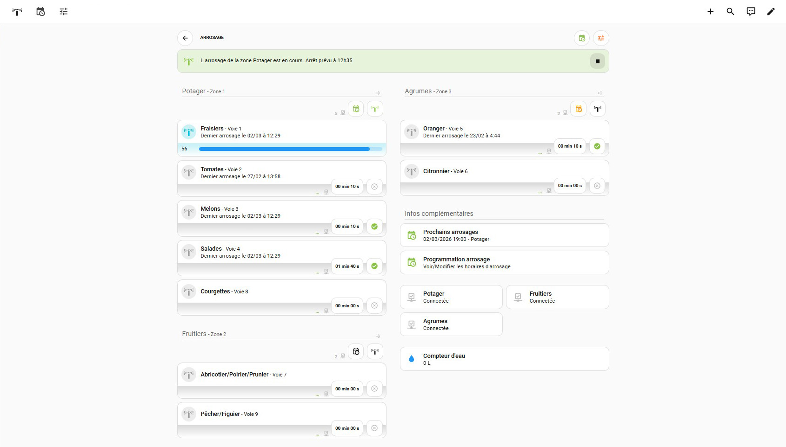</p>
<p align="center">Une vue d'ensemble de la page arrosage.</p>
<br>


<p align="center">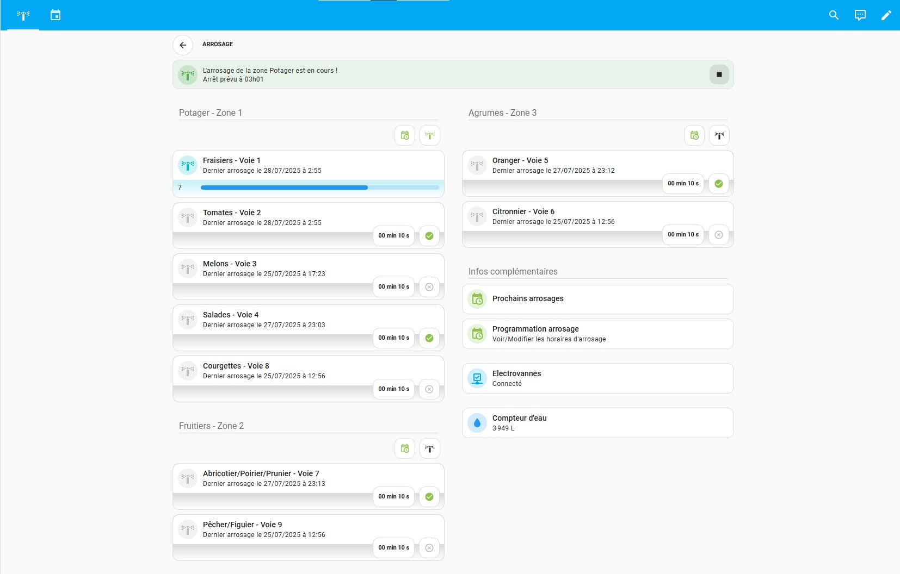</p>
<p align="center">Une vue d'ensemble de la page arrosage lorsqu'un arrosage de zone est en cours.</p>
<br>
[Le code de la page](https://../Dashboard/arrosage_page.yaml)
<br><br>


#### Les cartes qui la composent :


- ***La carte navigation*** :
<p align="center">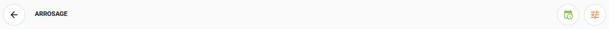</p>
Une carte qui affiche simplement le nom de la page en affichée ainsi qu'un bouton pour retourner à la page précédente.<br>
Cette carte n'est pas nécessaire au dashboard arrosage en lui même.
<br><br><br>

- ***La carte notification*** :
<p align="center">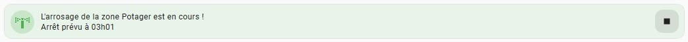</p>
Cette carte affiche si un arrosage de zone est en cours. On retrouve l'heure de fin du cycle prévue ainsi qu'un bouton permetttant d'arrêter l'arrosage de zone en cours.
<br><br>
L'ensemble des cartes notifications
<p align="center">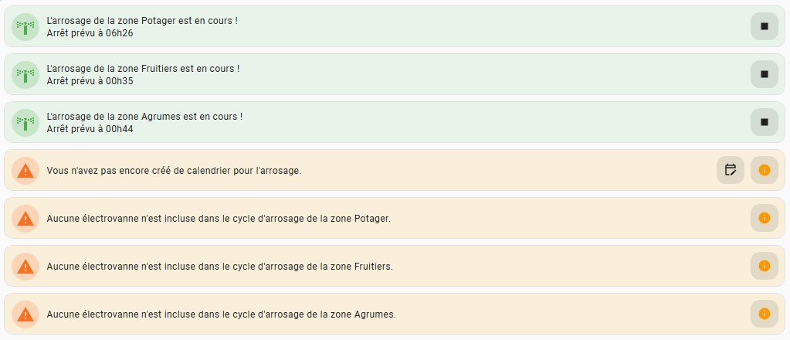</p>
<br><br>

- ***La carte zone*** :
<p align="center">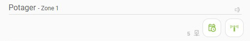</p>
Cette carte affiche le nom de la zone d'arrosage. Elle permet de choisir si cette zone d'arrosage doit être incluse dans les programmations du calendrier et également de déclencher un arrosage manuel de la zone.
<br><br><br>

- ***La carte electrovanne*** :
<p align="center">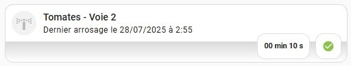</p>
Carte qui permet de déclencher/arrêter une électrovanne manuellement. Elle permet aussi de régler la durée du cycle d'arrosage de cette électroavnne et d'inclure ou non cette électrovanne au cycle d'arrosage de la zone dans laquelle elle se trouve.<br>
Elle affiche également la date et l'heure du dernier cycle de fonctionnement l'électrovanne.
<br><br><br>

- ***La carte electrovanne*** (Avec arrosage en cours) :
<p align="center">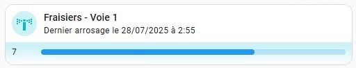</p>
Quand une électrovanne est en fonctionnement l'affichage de la carte change pour afficher le temps restant.
<br><br><br>

- ***La carte electrovanne*** (Avec compteur d'eau) :
<p align="center">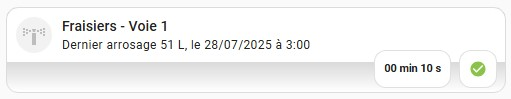</p>
Si vouz avez un sensor qui comptabilise votre consommation d'eau, la consommation du dernier cycle de l'électrovanne peut être affiché.
<br><br><br>

- ***La carte titre*** :
<p align="center">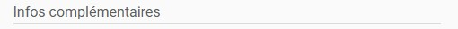</p>
Une carte qui affiche simplement un titre stylisé.
<br><br><br>

- ***La carte prochains arrosages*** :
<p align="center">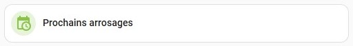</p>
Cette carte récupère automatiquement les infos du calendrier d'arrosage pour les afficher. Par contre il est impératif pour qu'elle affiche quelque chose, d'avoir au préalable installer et configurer le helper https://github.com/kgn3400/calendar_merge disponible sur HACS.
<br><br>
L'ensemble des cartes prochains arrosages
<p align="center">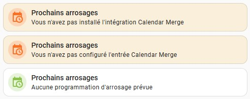</p>
<br><br>

- ***La carte programmation d'arrosage*** :
<p align="center">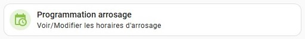</p>
Carte qui permet d'afficher la page calendrier d'arrosage.
<br><br><br>

- ***La carte connectivité*** :
<p align="center">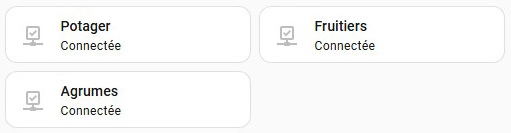</p>
Si vous avez un sensor qui permet de savoir si vos électrovannes sont connectées à votre serveur Home Assistant, cette carte affiche l'état de la connectivité.
<br><br><br>

- ***La carte compteur d'eau*** :
<p align="center">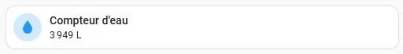</p>
Si vous avez un sensor qui comptabilise votre consommation d'eau, cette carte affiche celle ci.
<br><br><br>


### La page calendrier d'arrosage<br><br>
<p align="center">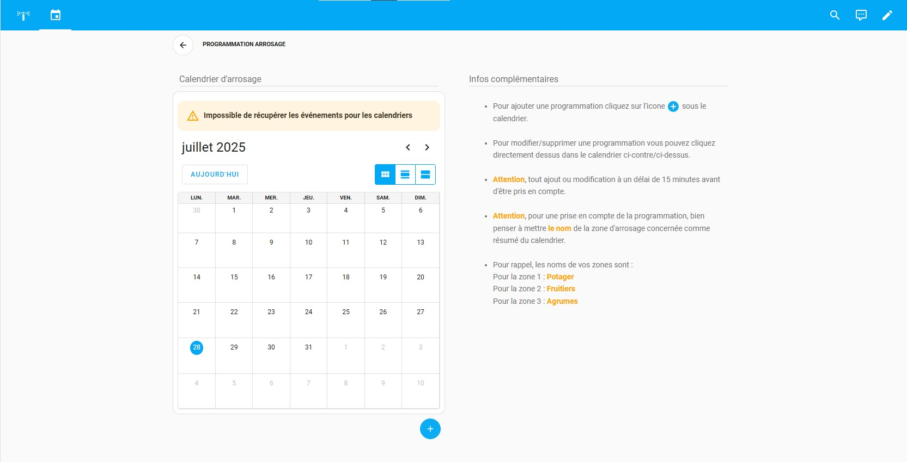</p>
<p align="center">Une vue d'ensemble de la page arrosage.</p>
<br><br>

#### Les cartes qui la composent :


<br><br>
