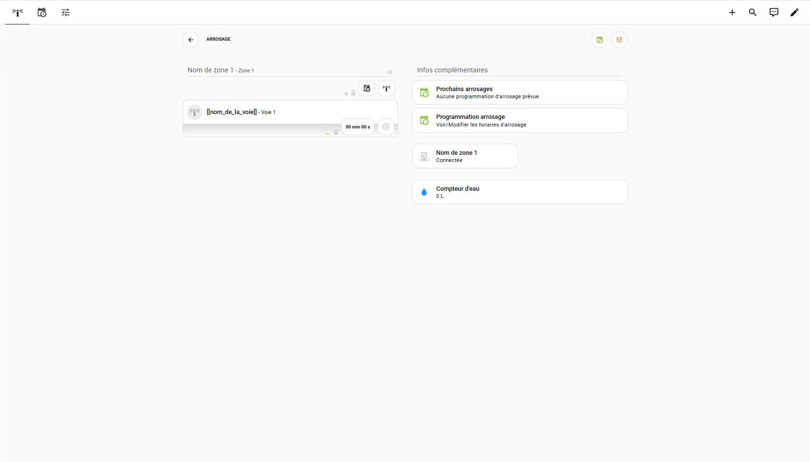
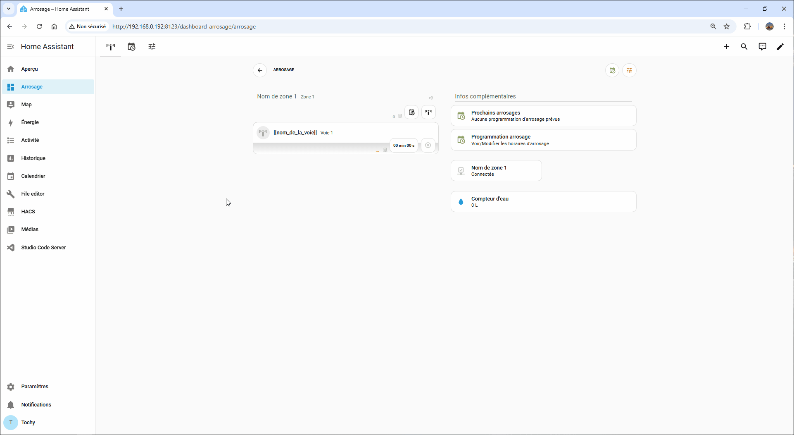

# En pratique

Maintenant que le **Dashboard Arrosage** est installé, vous pouvez l'ajuster à votre jardin. Pour l'exemple je vais partir sur mon propre usage.

 

##

### Objectif

Passer de :

&nbsp;&nbsp;&nbsp;>>>&nbsp;&nbsp;&nbsp;

Dans mon cas j'ai besoin de 3 zones nommées `Potager`, `Fruitiers` et `Agrumes` ainsi que 9 voies.

| Potager | Fruitiers | Agrumes | 
| :---: | :---: | :---: |
| Voie 1 - Fraisiers Voie 2 - Tomates Voie 3 - Melons Voie 4 - Salades Voie 8 - Courgettes | Voie 7 - Abricotier/Poirier/Prunier Voie 9 - Pêcher/Figuier | Voie 5 - Citronnier Voie 6 - Oranger |

#### **1️⃣ Ajouter le nombre de zones et voies nécessaires**

Rendez vous sur la page **`Paramètres`** et cliquez sur les cartes d'ajout de zones et de voies et ensuite redémarrer votre serveur pour la prise en compte des modifications.

#### **2️⃣ Ajouter les cartes zones et les nommer**

Sur la page **`Arrosage`** on va ajouter les cartes pour les zones ainsi que les cartes de notifications ou d'informations pour celles ci. On en profitera également pour nommer les zones et disposer les cartes à l'emplacement voulu sur la page.

#### **3️⃣ Ajouter les cartes voies et les nommer**

On va maintenant ajouter les cartes pour les voies, nommer celles-ci et disposer les cartes à l'emplacement voulu sur la page.

     
