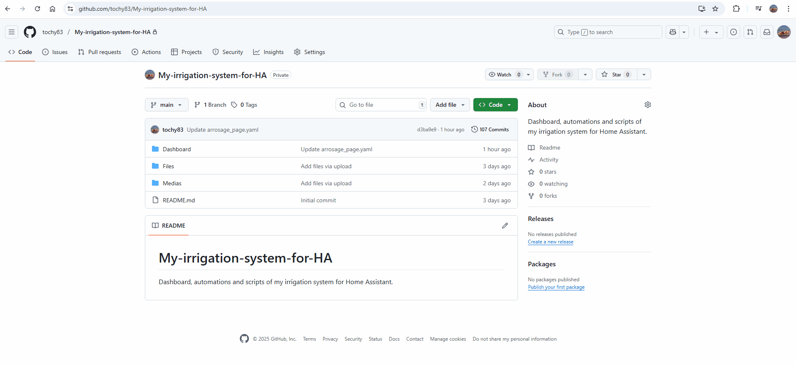

# Installation

Vous trouverez sur cette page toutes les explications nécessaires à la mise en place du Dashboard arrosage ainsi que de toutes les automatisations, scripts, entrées utiles à son bon fonctionnement.
<br><br>

#### Les modules complémentaires nécessaires pour installer le dashboard :
* File Editor ou Studio Code Server
* Si vous avez en plus Samba Share c'est un plus pour la copie des fichiers (C'est bien plus rapide qu'avec File Editor)
<br><br>

#### Integrations nécessaires au fonctionnment du dashboard arrosage :

* Calendrier local disponible dans les intégrations de base de HA
* Les [mushrooms card](https://github.com/piitaya/lovelace-mushroom?tab=readme-ov-file#-mushroom) disponibles sur HACS
* [Card mod 3](https://github.com/thomasloven/lovelace-card-mod?tab=readme-ov-file#card-mod-3) disponible sur HACS
* [Vertical stack in card](https://github.com/ofekashery/vertical-stack-in-card?tab=readme-ov-file#vertical-stack-in-card) disponible sur HACS
* [Timer bar card](https://github.com/rianadon/timer-bar-card?tab=readme-ov-file#timer-bar-card) disponible sur HACS
* [Calendar merge](https://github.com/kgn3400/calendar_merge?tab=readme-ov-file#calendar-merge-helper) disponible sur HACS
* Et bien sur HACS pour pouvoir installer tout ce que je viens de lister ci-dessus
<br><br>

Pour bénéficier de la réception des notifications envoyées par "l'intégration", il faut avoir installé également l'application sur son smartphone ou une tablette.
Ce n'est pas une obligation mais dans ce cas là vous n'aurez simplement pas de notifications. De toute façon, par défaut elles sont désactivées.
<br><br>


Pour coller au plus grand nombre, toutes les étapes de l'installation de je vais décrire seront réalisées avec File Editor.
<br><br>

### Les différentes étapes de l'installation :

* #### Etape 1 :
Vérifier que tous les modules complémentaires et les intégrations nécessaires (voir le listing ci-dessus) sont installés sur votre instance de Home Assitant.
<br>
Je ne rentrerai pas ici dans les détails de comment installer tout ça. Je pars du principe que si vous en êtes à faire des "dashboards avancés", c'est que vous maitrisez cette partie. Si ce n'est pas le cas dans les liens que j'ai mis il y'a en général toutes les explications nécessaires et dans tous les cas ces sujets ont été abordés maintes fois sur le forum HACF.
<br><br>

* #### Etape 2 :
Vérifier dans le fichier 'configuration.yaml' les packages sont actifs. Si vous ne voyez pas de quoi je parle c'est que probablement vous ne les avez jamais utlisé et que du coup ils ne sont pas actifs.
A l'aide de File Editor, ouvrer le fichier 'configuration.yaml' et rechercher si il contient la ligne suivante :
```yml
  packages: !include_dir_named packages
```
Si oui c'est tout bon, sinon il va falloir la rajouter sous la "clé" 'homeassistant:' pour au final avoir un résultat qui ressemble à ça :
```yml
homeassistant:
  packages: !include_dir_named packages
```
Si vous avez déjà d'autres lignes sous la "clé" 'homeassistant:' vous les laissez bien sur et vous rajouter simplement :
```yml
  packages: !include_dir_named packages
```
Un fois ceci fait vous allez dans Outils de développement, vous vérifiez la configuration pour être sur qu'il n'ya pas d'erreurs et vous redemarrez Home Assistant.
<br>

Pour en savoir plus sur les packages et découvrir leur intérêt, vous pouvez lire cet [article](https://www.domo-blog.fr/packages-home-assistant-organiser-configuration-code-yaml-domotique/) sur Domo-blog.fr
<br><br>

* #### Etape 3 :
Depuis [la page d'accueil de ce 'repository'](https://github.com/tochy83/My-irrigation-system-for-HA) télécharger le fichier zip contenant toutes les fichiers de "l'intégration".
<br>

Une fois téléchargé, vous pouvez les extraires dans le dossier de votre choix.
<p align="center"></p>

<br><br>


