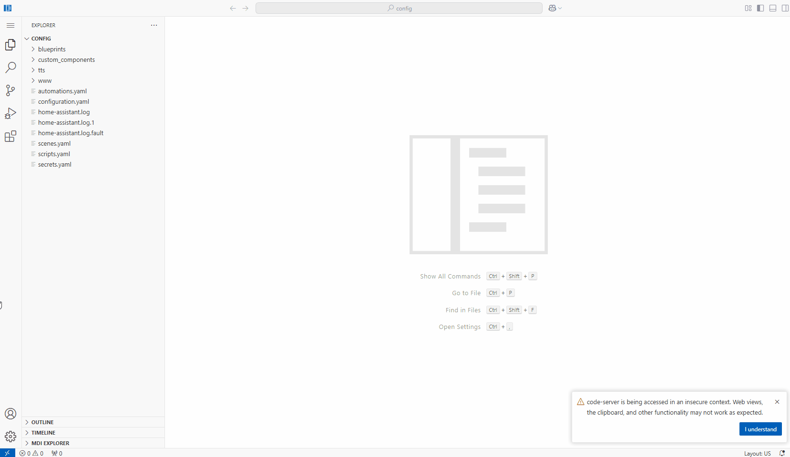
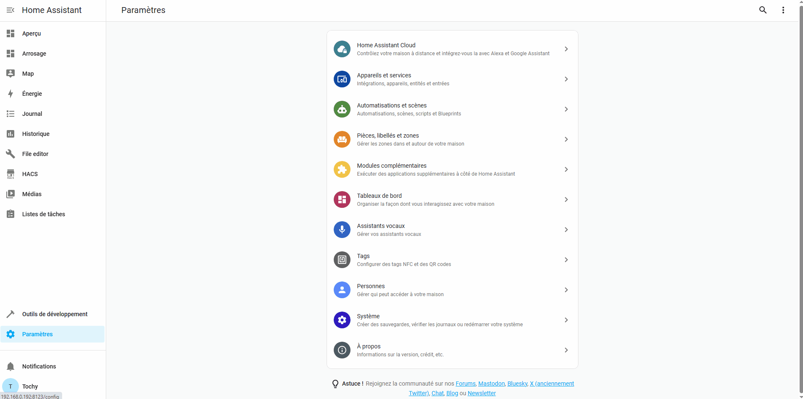
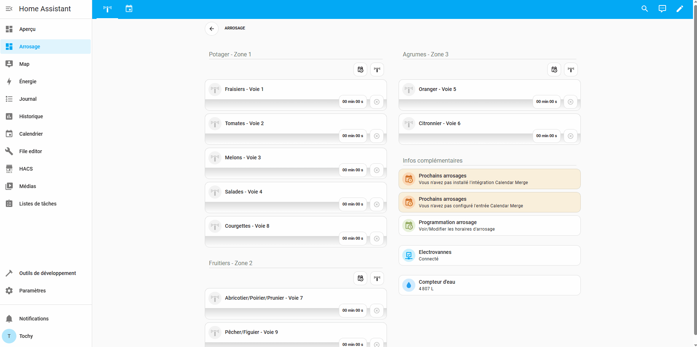

# Installation

Vous trouverez sur cette page toutes les explications nécessaires à la mise en place du Dashboard arrosage ainsi que de toutes les automatisations, scripts, entrées utiles à son bon fonctionnement.
<br><br>

#### Les modules complémentaires nécessaires pour installer le dashboard :
* 'Studio Code Server' ou 'Samba share' pour la copie des fichiers. Cela est possible avec seulement 'File Editor' mais il y'a une cinquantaine de fichiers à copier, donc à vous de voir.
<br><br>

#### Integrations nécessaires au fonctionnment du dashboard arrosage :

* Calendrier local disponible dans les intégrations de base de HA
* Les [mushrooms card](https://github.com/piitaya/lovelace-mushroom) disponibles sur HACS
* [Card mod 3](https://github.com/thomasloven/lovelace-card-mod) disponible sur HACS
* [Vertical stack in card](https://github.com/ofekashery/vertical-stack-in-card) disponible sur HACS
* [Timer bar card](https://github.com/rianadon/timer-bar-card?tab=readme-ov-file) disponible sur HACS
* [Calendar merge](https://github.com/kgn3400/calendar_merge?tab=readme-ov-file) disponible sur HACS
* [Streamline card](https://github.com/brunosabot/streamline-card) disponible sur HACS
* [Spook](https://github.com/frenck/spook) disponible sur HACS
* Et bien sur HACS pour pouvoir installer tout ce que je viens de lister ci-dessus mais vous devriez déjà l'avoir, n'est ce pas ?
<br><br>

> **Pour bénéficier de la réception des notifications** envoyées par "l'intégration", il faut avoir installé également **l'application sur son smartphone ou une tablette**.
Ce n'est pas une obligation mais dans ce cas là vous n'aurez simplement pas de notifications. De toute façon, par défaut elles sont désactivées.
> <br>
> 
> Je précise également que le script des notifications a été ecrit pour des appareils tournant sous ANDROID. Je ne sais pas quelle sera sont comportement sous IOS puisque les 2 plateformes ne supportent pas les mêmes fonctionnalités pour les notifications (tout du moins dans leur syntaxe). Je suppose que si vous utilisez déjà cette fonctionnalité sur votre appareil IOS, vous saurez adapter le script à celui-ci.
> <br>
> 
> Je l'ai également adapté "l'intégration" pour avoir la possibilité de recevoir les notifications sur Télégram. Pour ça, il faut bien sur avoir l'intégration Télégram d'installée au préalable. Comme pour les notifications
> vers l'application mobile elles sont désactivées par défaut.

<br><br>

### Les différentes étapes de l'installation :

<br>

> Certains screenshots ou vidéos, présents ci-dessous peuvent ne pas être à jour car j'ai ajouté de nouvelles fonctionnalités depuis que j'ai rédigé cette page.
> Cela ne modifie en rien la procédure d'installation.
<br>

#### - ***Etape 1*** :
Vérifier que tous les modules complémentaires et les intégrations nécessaires (voir le listing ci-dessus) sont installés sur votre serveur de Home Assitant.
<br>
Je ne rentrerai pas ici dans les détails de comment installer tout ça. Je pars du principe que si vous en êtes à faire des "dashboards avancés", c'est que vous maitrisez cette partie. Si ce n'est pas le cas dans les liens que j'ai mis il y'a en général toutes les explications nécessaires et dans tous les cas ces sujets ont été abordés à maintes reprises sur le [forum HACF](https://forum.hacf.fr/).
<br><br>

S'assurer que vous n'avez pas d'entités sur votre serveur Home Assistant ayant les même 'entity_id' que ceux que l'on s'apprête à installer.
<br>

Pour ça, on se rend dans Outils de développement/Modèle et on copie dans l'éditeur de modèle tous le bloc de code ci-dessous :
```yml

Entités en commun avec Arrosage : {{entites|count}}

Pas de soucis pour procéder à l'installation

Installation déconseillée en l'état. Vous avez ces entités en commun avec l'intégration :
 - {{ entites|join('\n - ')}}

```
<br>

Si c'est tout bon, vous devriez voir un message comme celui-ci :
<p align="center"></p>

Sinon le résultat ressemblera plus à ça, avec une liste de toutes les entités ayant un 'entity_id' en commun avec "l'intégration" :
<p align="center"></p>
<br>


#### - ***Etape 2*** :
Vérifier dans le fichier 'configuration.yaml' si les packages sont actifs. Si vous ne voyez pas de quoi je parle c'est que probablement vous ne les avez jamais utlisé et que du coup ils ne sont pas actifs.
A l'aide de 'File Editor' ou 'Studio Code Server', ouvrez le fichier 'configuration.yaml' et rechercher si il contient la ligne suivante :
```yml
  packages: !include_dir_named packages
```
Si oui c'est tout bon et vous pouvez passer directement à l'étape 3, sinon il va falloir la rajouter sous la "clé" 'homeassistant:' pour au final avoir un résultat qui ressemble à ça :
```yml
homeassistant:
  packages: !include_dir_named packages
```
Si il y a déjà d'autres lignes sous la clé 'homeassistant:' on les laisse bien sur et on rajoute simplement :
```yml
  packages: !include_dir_named packages
```
Une fois l'ajout effectué, on va dans Outils de développement, on vérifie la configuration pour être sur qu'il n'ya pas d'erreurs et on redémarre Home Assistant.
<br>

Pour en savoir plus sur les packages et découvrir leur intérêt, vous pouvez lire cet [article](https://www.domo-blog.fr/packages-home-assistant-organiser-configuration-code-yaml-domotique/) sur Domo-blog.fr
<br><br>

> Il est possible, si vous utilisez déjà les packages que vous ayez la ligne
> ```
>packages: !include_dir_merge_named packages/
> ```
> Au lieu de
> ```
> packages: !include_dir_named packages
> ```
> Dans ce cas il y a quelques modifications à faire pour rendre "l'intégration" instalable.

<br>

#### - ***Etape 3*** :
Depuis [la page d'accueil](https://github.com/tochy83/My-irrigation-system-for-HA) de ce 'repository' télécharger le fichier zip contenant tous les fichiers de "l'intégration".
<p align="center"></p>

Une fois téléchargé, on les extrait dans le dossier de son choix.
<br><br>


#### - ***Etape 4*** :
A l'aide de 'Studio Code Server', créer dans le dossier 'config' de Home Assistant, un dossier nommé 'packages'.
<br>

- Dans ce dossier 'packages' créer un dossier 'arrosage'.
<p align="center"></p>
<br>


#### - ***Etape 5*** :
A l'aide de 'Studio Code Server', copier tous les fichiers et dossiers se trouvant dans le dossier 'Files' du zip décompressé précedemment, dans le dossier 'arrosage' que l'on vient de créer.
<p align="center"></p>

La structure finale du dossier 'arrosage' doit être celle-ci :
<p align="center"></p>

Une fois ceci fait on va dans Outils de développement, on vérifie la configuration pour être sur qu'il n'ya pas d'erreurs et on redémarre Home Assistant.
<br><br>


#### - ***Etape 6*** :
Vient enfin la mise en place du Dashboard en lui même.
<br>

Pour ne pas risquer de casser votre Dashboard principal de Home Assistant, on va en créer un nouveau dans un premier temps. Si par la suite tout se passe bien et que l'intégration vous convient vous pourrez simplement copier ses 2 pages dans votre Dashboard principal.
<br>

A l'aide d'un éditeur de texte, ouvrir le fichier 'dashboard.yaml' situé dans le dossier 'Dashboard' du zip décompressé à l'étape 3, sélectionner tout son contenu et le copier.
<br>

Ajouter un nouveau Dashboard nommé 'Arrosage' à Home Assistant. **Ici aussi respecter le nom** car des liens dans le Dashboard l'utilise.
<br>

Modifier ce nouveau Dashboard pour y coller le contenu du fichier 'dashboard.yaml'.
<p align="center"></p>

Maintenant "l'intégration" est opérationnelle, il ne reste plus qu'à configurer le calendrier pour pouvoir activer la programmation.
<br><br>


#### - ***Etape 7*** :
Ajouter l'intégration 'Calendrier local si elle n'est pas déjà présente sur votre serveur de Home Assistant.
<p align="center"></p>

Ajouter un calendrier nommé 'Arrosage', à l'intégration 'Calendrier local'. **Ici aussi le nom du calendrier** à son importance pour un fonctionnement "Out of the box" de "l'intégration".

Si vous avez déjà un calendrier nommé 'Arrosage', pas de soucis ça fonctionnera également.
<p align="center"></p>
<br><br>


#### - ***Etape 8*** :
Si ce n'est pas dejà fait, ajouter l'intégration 'Calendar merge'. Normalement vous auriez du le faire à l'étape 1.
<p align="center"></p>
<br>

Configurer une entrée pour l'intégration 'Calendar merge'.
<p align="center"></p>

Le fait de configurer cette intégration, va créer 5 entrées supplémentaires. Ce sont ces entrées qui permettent d'afficher les arrosages à venir du calendrier.
<br>

Dans la configuration nommer le capteur 'Arrosage a venir', il est **important de respecter ce nom**. Mettre 7 jours pour avoir les événements à venir sur une semaine, 3 en nombre maximum d'événements parce que par défaut il y'a 3 zones d'arrosage, activer 'Supprimer les événements récurrents du calendrier', choisir le calendrier 'Arrosage' et sur la seconde page, activer 'Afficher l'événement du calendrier comme heure de' et laisser le reste par défaut.
<br><br>


#### - ***Etape 9*** :
**[Voilà c'est fini](https://www.youtube.com/watch?v=EVDlleOUQXY)**
<br>

Il n'y a plus rien à faire si ce n'est de pouvoir enfin **tester toutes les fonctionnalités** de "l'intégration" 'My-irrigation-sytem-for-HA'.
<br>

Pour tester la partie programmation, il faudra bien sur ajouter des événements au calendrier d'arrosage. Je montre comment faire à la fin de la vidéo ci-dessous.
<br>

Je rappelle qu'à ce stade "l'intégration" tourne en mode simulation afin que vous puissiez vous faire une idée de son fonctionnement ou de voir comment elle est construite en examinant les différents fichiers et cartes de celle-ci.
<br><br><br>

<div align="center">

  [](https://www.youtube.com/watch?v=Ewms74Tb5es "Lancer la vidéo")

</div>

*<p align="center">Une vidéo complète de l'installation pas à pas en partant d'un Home Assistant vierge ou j'ai juste installé tous les modules complémentaires et intégrations nécessaires à l'installation et au fonctionnement du Dashboard. La seule différence avec les étapes décrites ci-dessus est que je passerai par l'explorateur de fichiers windows pour créer les différents dossiers nécessaires au packages et copier les fichiers car c'est plus rapide pour la vidéo.</p>*
<br><br><br>
