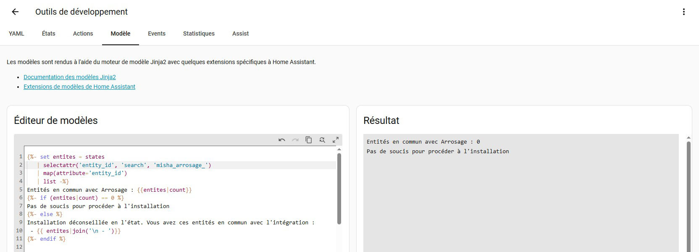
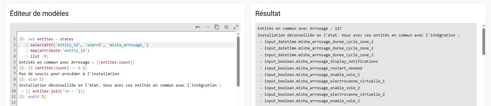
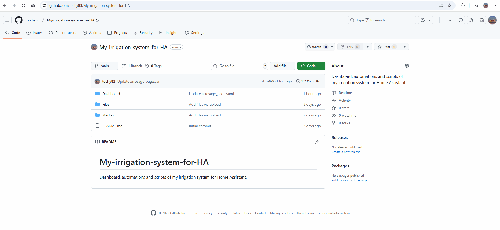
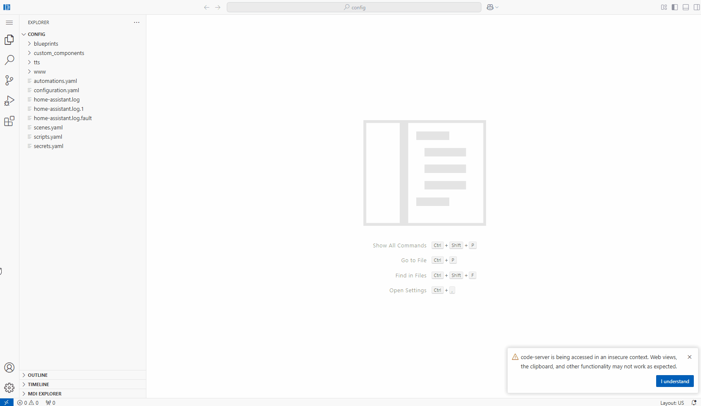
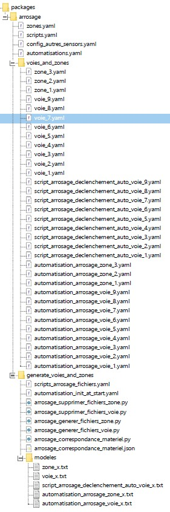
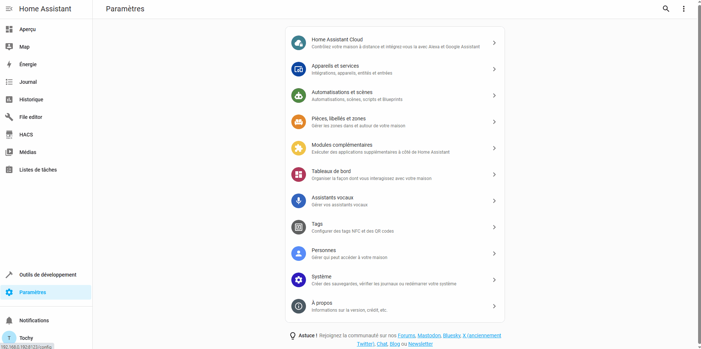
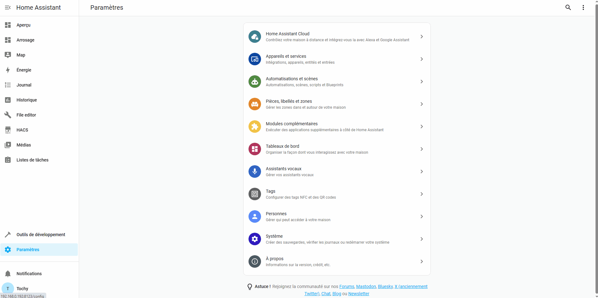
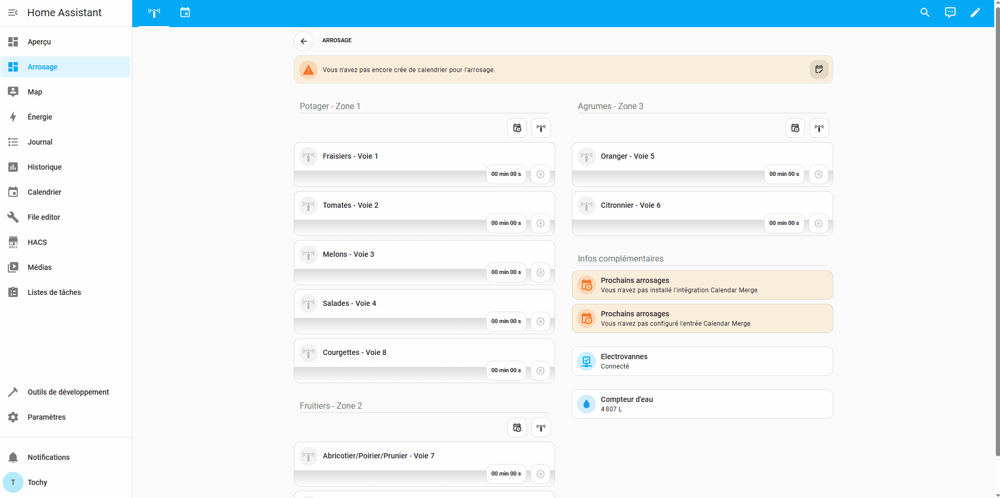
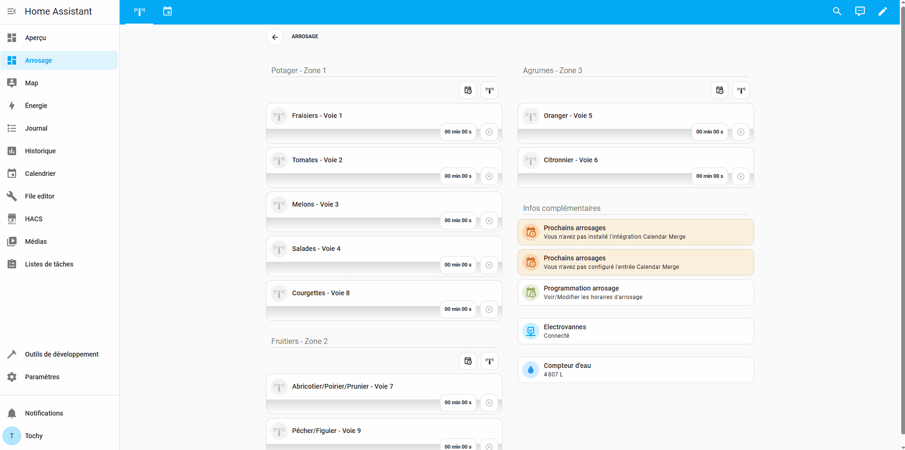
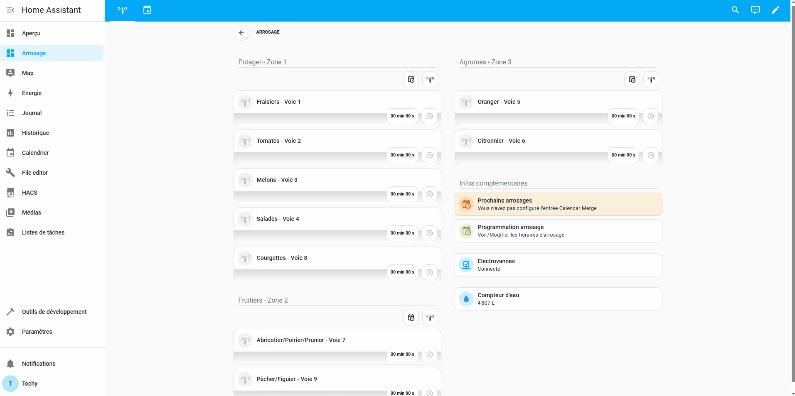

# Installation du Dashboard Arrosage

Bienvenue sur la page d'installation. Vous trouverez ici toutes les explications nécessaires pour mettre en place le **Dashboard Arrosage**, ainsi que les automatisations, scripts et entrées utiles.

---

### 🛠️ Prérequis techniques

Avant de commencer, assurez-vous d'avoir les outils et intégrations suivants installés sur votre instance Home Assistant.

#### **Apps (anciennement Modules complémentaires)**
* **Recommandé :** `Studio Code Server` ou `Samba share` (indispensable pour copier tous les fichiers rapidement).
* **Alternative :** `File Editor` (possible, mais laborieux au vu du nombre de fichiers).

#### **Intégrations nécessaires au fonctionnement**
| Type | Nom & Lien |
| :--- | :--- |
| **UI / Cartes** | [Mushroom card](https://github.com/piitaya/lovelace-mushroom) • [Card mod](https://github.com/thomasloven/lovelace-card-mod) • [Vertical stack in card](https://github.com/ofekashery/vertical-stack-in-card) • [Timer bar card](https://github.com/rianadon/timer-bar-card) • [Streamline card](https://github.com/brunosabot/streamline-card) |
| **Système** | [Calendar merge](https://github.com/kgn3400/calendar_merge) • [Spook](https://github.com/frenck/spook) • `Calendrier local` (natif HA) |

> [!IMPORTANT]
> **Notifications :** Pour recevoir les alertes, l'application officielle doit être installée sur votre mobile/tablette. 
> * **Android :** Entièrement supporté par défaut.
> * **iOS :** La syntaxe des notifications peut varier, une adaptation du script sera peut être nécessaire.
> * **Telegram :** Entièrement supporté par défaut (nécessite l'installation préalable de l'intégration Telegram).

---

### 🚀 Étapes de l'installation

> [!NOTE]
> Certains screenshots ou vidéos peuvent présenter de légères différences suite aux mises à jour de l'intégration, mais la procédure reste strictement identique.

#### **1️⃣ Vérification préalable**
Pour éviter tout conflit, vérifiez qu'aucune entité existante n'utilise déjà les ID du projet.
Allez dans **Paramètres > Outils de développement > Modèle** et collez le code suivant :

```yml

Entités en commun avec Arrosage : {{entites|count}}

Pas de soucis pour procéder à l'installation

Installation déconseillée en l'état. Vous avez ces entités en commun avec l'intégration :
 - {{ entites|join('\n - ')}}

```

<p align="center">


</p>

---

#### **2️⃣ Activation des Packages**

Vérifiez si les packages sont actifs dans votre `configuration.yaml`. Ouvrez le fichier et recherchez la ligne suivante sous la clé `homeassistant:` :

```yaml
homeassistant:
  packages: !include_dir_named packages

```

*Si elle n'existe pas, ajoutez-la, vérifiez la configuration et redémarrez Home Assistant.*

> [!TIP]
> Pour en savoir plus sur l'intérêt des packages, consultez cet [article sur Domo-blog.fr](https://www.domo-blog.fr/packages-home-assistant-organiser-configuration-code-yaml-domotique/).


> [!NOTE] 
> Il est possible, si vous utilisez déjà les packages mais de manière différente et que vous ayez la ligne :
> ```
>packages: !include_dir_merge_named packages/
> ```
> Dans ce cas il y a quelques modifications à faire pour rendre l'intégration instalable.
---

#### **3️⃣ Téléchargement**

Téléchargez le fichier ZIP contenant l'intégration depuis la [page d'accueil du repository](https://github.com/tochy83/My-irrigation-system-for-HA).

<p align="center"></p>

---

#### **4️⃣ Transfert des fichiers**

1. À l'aide de **Studio Code Server**, créez un dossier `packages` dans `/config/`.
2. Copiez le dossier `misha_arrosage` du ZIP dans le dossier `packages` que vous venez de créer.

<p align="center">


</p>

**Structure finale attendue :**

<p align="center"></p>

---

#### **5️⃣ Redémarrage du serveur**

Pour finaliser l'installation, il faut maintenant redémarrer Home Assistant. Allez dans **Paramètres > Outils de développement > YAML** et cliquez sur `Vérifier la configuration`. Si le message `La configuration n'empêchera pas Home Assistant de démarrer !` apparait, vous pouvez cliquer sur `Redémarrer` puis `Redémarrer Home Assistant`.

> [!IMPORTANT]
> Si le message `La configuration n'empêchera pas Home Assistant de démarrer !` n'apparaissait pas il est probable que vous ayez fait une erreur à l'étape 2️⃣ ou 4️⃣.
> Vérifiez donc ces 2 étapes.
---
#### **6️⃣ Mise en place du Dashboard**

1. Créez un nouveau Dashboard nommé **Arrosage** (respectez la casse, des liens internes l'utilisent).
2. Ouvrez le fichier `dashboard.yaml` (présent dans le ZIP), copiez tout son contenu et collez-le dans l'éditeur de configuration de votre nouveau dashboard.

<p align="center"></p>

---

#### **7️⃣ Configuration du Calendrier**

Ajoutez l'intégration **Calendrier local** (si vous ne l'utilisez pas déja) et créez un calendrier nommé exactement `Arrosage`.

<p align="center">


</p>

> [!NOTE] 
> Si vous avez déjà un calendrier nommé `Arrosage`, c'est celui-ci qui sera utilisé.
---

#### **8️⃣ Liaison avec Calendar Merge**

Configurez une entrée pour l'intégration **Calendar Merge**.
**C'est cette étape qui permet l'affichage des arrosages à venir.**

* **Nom du capteur :** `Arrosage a venir` (Strictement !)
* **Nombre max d'événements :** 3
* **Période :** 7 jours
* **Option :** Activer "Afficher l'événement du calendrier comme heure de".

<p align="center">


</p>

---

### 🎉 C'est fini !

Il ne vous reste plus qu'à tester toutes les fonctionnalités. Pour la partie programmation, ajoutez simplement des événements au calendrier comme montré dans la vidéo ci-dessous.

> [!NOTE]
> L'intégration tourne actuellement en **mode simulation** pour vous permettre de découvrir le fonctionnement sans activer vos vannes réelles.

<div align="center">

  [](https://www.youtube.com/watch?v=Ewms74Tb5es "Lancer la vidéo")

</div>

*<p align="center">Une vidéo complète de l'installation pas à pas en partant d'un Home Assistant vierge ou j'ai juste installé tous les modules complémentaires et intégrations nécessaires à l'installation et au fonctionnement du Dashboard. La seule différence avec les étapes décrites ci-dessus est que je passerai par l'explorateur de fichiers windows pour créer les différents dossiers nécessaires au packages et copier les fichiers car c'est plus rapide pour la vidéo.</p>*
<br><br><br><br><br>
