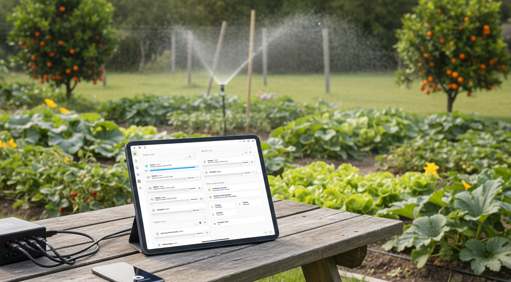

# My-Irrigation-System-for-HA

Un **dashboard pour Home Assistant**, permettant de contrôler simplement le système d'arrosage de son jardin.

 

##

### 🎯 L'objectif de départ

Répliquer le fonctionnement d'un programmateur d'arrosage de la marque Hunter (ceux d'autres marques fonctionnant à peu de choses près de la même façon) que j'avais pour l'arrosage de mon jardin. Rendre le tout plus ergonomique et profiter des avantages de Home Assistant.

- Pouvoir déclencher l'arrosage d'une voie.
- Pouvoir régler le temps d'arrosage d'une voie.
- Pouvoir déclencher manuellement l'arrosage d'une zone (plusieurs voies).
- Faire en sorte que lors d'un arrosage de zone, chaque voie attente la fin du cycle de la précédente avant de se déclencher.
- Pouvoir établir/supprimer un planning d'arrosage de zone.
- Pouvoir inclure/exclure une voie d'un planning d'arrosage de zone.

Pour résumé, les fonctions de base de tout programmateur d'arrosage, auquel j'ai ajouté :

- Un dashboard pour piloter tout ça de manière simple et intuitive.
- L'envoi de notifications vers l'application mobile (désactivables) et/ou Télégram pour avoir un retour sur l'état du système.
- Pouvoir tenir compte des conditions climatiques pour la durée d'arrosage.

Ça c'était la partie simple puisque ça tourne chez moi comme ça depuis 2 ans.

### 🚀 L'objectif que je me suis fixé

- Laisser la possibilité à tout le monde de tester le dashboard avec un **mode démo**.
- Avoir la possibilité d'interagir avec **tout matériel** susceptible de pouvoir piloter un arrosage depuis home assistant.
- Avoir une façon relativement simple de passer du **mode démo** au **mode production**.
- Essayer de nouvelles choses que je ne connaissais pas ou maîtrisais pas sur Home Assistant.
- Avoir **zéro yaml** pour que vous l'adaptiez à votre configuration.

### 📖 Laisser vous guider pour la mise en place

 

🛠️ [`L'installation`](INSTALLATION.md). Toutes les étapes pour une installation pas à pas du **Dashboard arrosage**.

⚙️ [`Personnalisation de votre système d'arrosage`](PERSONNALISATION.md). Comment passer du système de base, à un système correspondant à votre jardin.

✅ [`Le passage en production`](PRODUCTION.md). Une fois le dashboard testé en **mode démo**, comment **piloter réellement** votre arrosage du jardin.

🖼️ [`Le dashboard et ses cartes`](DASHBOARD.md). Toutes les **cartes** utiles du dashboard avec leurs **fonctions et codes**.

📚 [`La documentation`](DOCUMENTATION.md).

     
